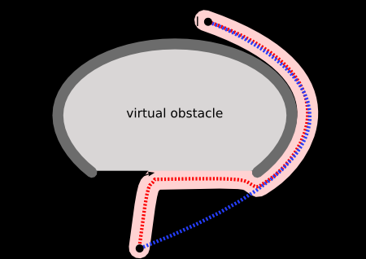

# A* Search Algorithm
Approximates the shortest path in a search where obstacles/hindrances may be present:



Expands the path with the **minimum value** for the function:
```
f = g + h
g(path) = path cost
h(path) = h(s) = estimated distance to goal from state
```


* *h* function is a **heuristic**
    * Changed/optimised for different situations

* Minimising *g* keeps path short
* Minimising *h* keeps search focused on the goal

Result: Search strategy that is **best possible**
* Finds the **shortest** length path while **expanding the minimum** number of paths possible
* 'Best estimated total path cost first'

Will always find the lowest cost path if:
* *h(s) < true cost*
    * h should never **overestimate** distance to goal
    * h is **optimistic**
    * h is **admissible**
        * 'valid' function for finding lowest cost path

Explanation:


* A* finds a path *P* from the inital state *S* to the goal state *G* with cost *C*
* At the goal, *h* function returns 0, so path cost *g* is the total cost of the path.
    * Therefore *C* = path cost *g*
* All other nodes on the frontier must have paths less than *P* as it is explored cheapest-first order

## Heuristics *h()*
* Minimise the number of paths expanded during the search
    * Greater efficiency
* Heuristic that is strictly >= to another gets closer to the perfect heuristic and therefore expands at least the same number of nodes or fewer
    * If *h<sub>1</sub>* had the **exact** cost as each node
        * Would expand the **least possible** number of nodes
    * If *h<sub>2</sub>* was **always 0**
        * Would expand the **most possible** number of nodes
    * Heuristic that **always** returns >= to another is closer to the perfect *h<sub>1</sub>*