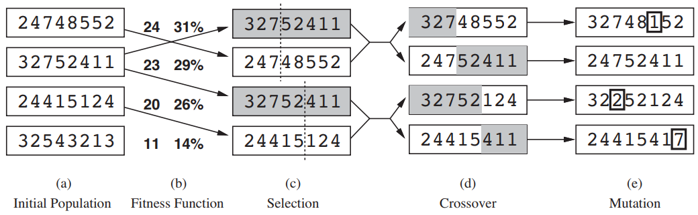
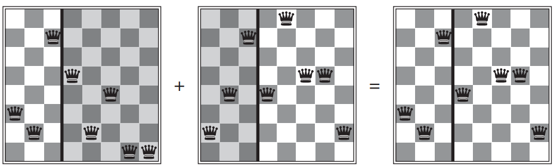

# Genetic Algoritms (GA)
Variant of Stochastic beam search where successor states are generated by **combining two parent states**
* Instead of modifying a single state
* Analagous to sexual reproduction

* Start with set of *k* randomly generated states -> the **population**
    * State also called an **individual**
    * State = **string over a finite alphabet**
        * i.e. string of 1's and 0's or string of digits within a range etc
* Fitness (objective) function used to rate each state
* Produce probabilities from ratings:
    * Normalize the scores to a percentage
    * Given scores of, 24,23,25
    * Percentage = score/sum = score/72
        * 33%, 32%, 35%
* Parent states are chosen at random, using the probabilities
* Parent states are then joined at a **crossover point** in the string, producing two children from splitting each parent:
    * i.e. after the third digit in the string:
        * First child gets first 3 digits from first parent and remaining digits from second parent
        * Second child gets first 3 digits from second parent and remaining digits from first
        * parents '12345678' and '67891235' create:
            * '12391235' and '67845678'
* **Random mutation** then applied to the child states with a *small independent probability*
    * Chance that one digit in the string is randomly changed

## In 8-Queens problem



First two parents and first offspring:



## Schema
* Useful **blocks** within the state strings that can be combined with other blocks to construct a solution.
* **Substring** in which some positions are left *unspecified*
    * For example '246*\*\***' = all 8-queens states where first three queends are in position 2, 4 and 6.
* **Instance** = string matching a schema
* GA works best when schemata = meaningful components of a solution
    * A good schema produces useful improvement in many solutions

## Pseudocode
```
function Genetic-Algorithm(population, Fitness-Fn) returns an individual
    inputs: population, set of individuals
            Fitness-Fn, function that measure fitness of an individual
    
    repeat
        new_population = empty set
        for i = 1 to Size(population) do:
            x = Random-Selection(population, Fitness-Fn)
            y = Random-Selection(population, Fitness-Fn)
            child = Reproduce(x, y)
            if (small random probability):
                child = Mutate(child)
            add child to new_population
        population = new_population
    until some individual is fit enough, or enough time has elapsed
    return the best individual in population, according to Fitness-Fn

function Reproduce(x, y) returns an individual
    inputs: x,y, parent individuals

    n = Length(x)
    c = random number from 1 to n
    return Append(Substring(x, 1, c), Substring(y, c+1, n))
```