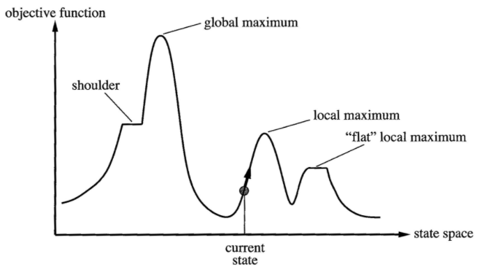

# Hill Climbing
General optimazation strategy for **local search**. 

* Starts with an *arbitrary* solution to a problem
* **Incrementally** changes a single element of the solution to improve solution:
    * If the change produces a better solution -> repeat incremental change on new solution
    * If no improvement found -> return answer

* i.e. 'At each step the current node is replaced by it's **best neighbor**'

* Also known as 'greedy local search'

## Example
* One-dimensional state-space 
* **Elevation** = objective function
    * Higher = better

* From current state:
    * Calculate gradient 1 unit on either side
    * Move 1 unit in the direction of the **most positive** gradient
    * If neither gradient improves solution:
        * Return current state



## Pseudocode
```
function Hill-Climbing(problem) -> returns a solution state
    inputs: problem = a problem
    static: current = a node
            next = a node
    
    current = Make-Node(Initial-State[problem])
    loop do
        next = highest valued successor of current
        if Value[next] < Value[current] -> return current
        current = next
    end
```

## Problems
* May **converge on local optima**
    * Not guaranteed to find **global optima**
* Ridges create a sequence of local maxima which are difficult to navigate
* Plateaus can cause algorithm to terminate early or to 'wander' in incorrect direction

## Random-Restart Hill-Climbing
* Series of hill-climb searches from randomly generated initial states
* *Trivially complete* - probability approaching 1
    * Eventually generate a goal state as a random initial state
* Given probability *p* of a hill-climb success:
    * Expected number of restarts is *1/p*
* Works quickly for state spaces with a **few local maxima/plateaux**
    * Where normal hill-climbing would fail
* For large (up to continuous/infinite) complex state spaces it becomes inefficient 