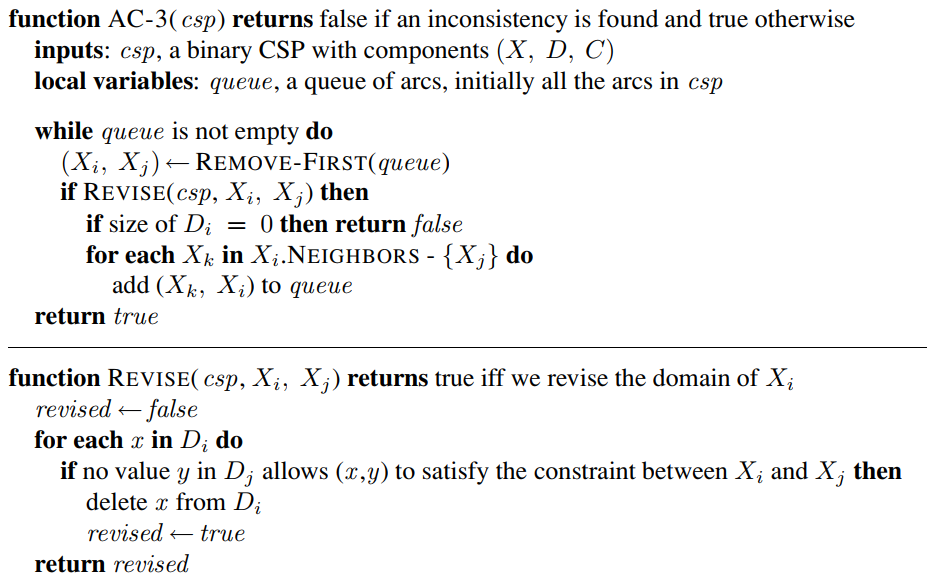

# Constraint Propagation: Inference
* Using constraints to reduce the number of legal values for a variable, which in turn can reduce the legal values for another variable and so on
* Intertwined with search techniques
    * If used as a pre-processing step before search is used, it can sometimes solve the whole problem before search is needed.
* Uses **Local Consistency**
    * Treat each variable as a node in a graph
    * Treat each *binary constraint* as an arc in the graph
    * Enforcing local constistency on each part of the graph causes *inconsistent* values to be eliminated throughout

## Types of consistency
### Node consistency
* Every value in a variables domain satisfy the variables **unary constraints**
* Node consisent *network* = **all** variables in the network are node consistent
### Arc consistency
* Every value in a variables domain satisfies the variables **binary constraints**
* *Xi* is node consistent with *Xj* if:
    * For every value in the current domain *Di*:
        * There is some value in the domain *Dj* that satisfies the **binary constraint**  on the arc *(Xi,Xj)*
* Example:
    * Constraint *Y=X2*, where domain for *X*,*Y* = set of digits
        * *C = <(X,Y), (0,0),(1,1),(2,4),(3,9)>*
    * Make *X* arc consistent w.r.t *Y* -> **reduce *X*'s domain**:
        * *Dx = {0,1,2,3}*
    * Make *Y* arc consistent w.r.t *X* -> **reduce *Y*'s domain**:
        * *Dy = {0,1,4,9}*
    * CSP is now arc consistent
            
* Arc consistent *network* = **all** variables in the network are arc consistent
* Solves CSP if arc-consistency reduces all domains to **size 1**
* CSP is **unsolvable** if arc-consistency reduces any domain to **size 0**
* Tightens down the domains in the CSP:
    * If arc-consistency doesn't directly solve the problem, the domains may be reduced making a solution using further techniques easier (i.e. search)
* **AC-3 algorithm** is used to make a CSP arc-consistent

    

### Path consistency
* Tightens binary constraints by using inferred *implicit* constraints
* set *{Xi,Xj}* is path consistent w.r.t a **third variabl *Xm* if:
    * For every assignment *{Xi=a,Xj=b}*
        * Consistent with constraints on *{Xi,Xj}* 
    * There is an assignment to *Xm* that satisfies the constraints on *{Xi,Xm}* and *{Xm,Xj}*
        * Path from *Xi* to *Xj* with *Xm* in the middle
* **PC-2** algorithm is used to make CSP path-consistent

### *K*-consistency
* CSP is *K*-consistent if:
    * For any set of *k-1* variables and for any consistent assignment to the variables:
        * A **consistent value can always be assigned to any *k*th variable**
* 1-consistency = node consistency
    * Given the **empty set** any set of one variable can be make consistent
* 2-consistency = arc consistency
* 3-consistency = path consistency **for binary constraint networks**
* **Strong *k*-consistency** = CSP that is *k*-consistent and *(k-1)* consistent and *(k-2)* consistent ... *1*-consistent

### Global constraints
* Constraint w/ arbitrary number of variables
* All variables are 'effectively' connected by a global constraint
* Check the domains of all variables to see if a global constraint is violate
* For *Alldiff*:
    * *n* possible distinct values, *m* variables -> if *m > n*, *Alldiff* cannot be satisfied
    * Remove any variable in constraint with a **singleton domain**
    * Delete variables value from the domains of all other variables
    * Repeat until no singleton variables left
    * If (at any point) an empty domain is present or there are more variables than domain values left -> **inconsistency** detected
* **Bounds propagation**
    * When domains = large set of integers, domains represented as upper and lower bounds
    * Domains are managed using bounds propagation:
        * If a constraint affects the bounds of a domain, this is propagated to the domain
        * Initial domains for number of passengers on planes *F1* and *F2*:
            *  *D1=[0, 165], D2=[0,385]*
        * Constraint = *F1* and *F2* must carry **420 people together**:
            * *D1=[35, 165], D2=[255,385]*
                * Bounds constraints propagated
                * Min/Max values for each:
                    * *F1 = 165, F2 = 255*
                        * 165 + 255 = 420
                    * *F1 = 35, F2 = 385*
                        * 35 + 385 = 420 
* **Bounds consistent CSP** = for every variable *X* and for lower and upper bound of *X* there exists some value of *Y* that satisfies the constraint between *X* and *Y* for every variable *Y*
