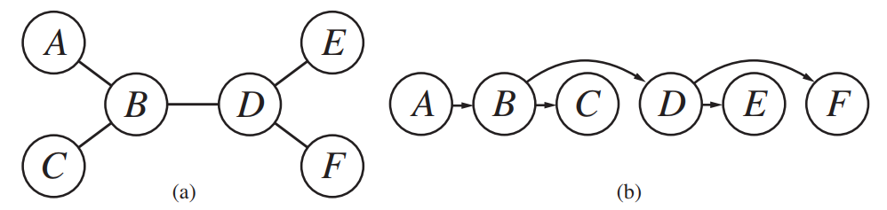

# Structure of CSP's
* Using constraint graphs to break up the CSP into **independent subproblems**

## Asserting Independence
* **Connected components** of the constraing graph
* Component is a subproblem *CSP<sub>i</sub>* if:
    * Assignment *S<sub>i</sub>* is a solution of *CSP<sub>i</sub>*, then U<sub>i</sub>*S<sub>i</sub>* is a solution of U<sub>i</sub>*CSP<sub>i</sub>*
* Reduces work to solve problem:
    * *Without* decomposition total work = *O(d<sup>n</sup>)*
        * **Exponential in *n***
    * If each CSP<sub>i</sub> has *c* (constant) variables of the total *n* variables for CSP and *d* = size of domain:
        * *n/c* subproblems
            * Each take at most *d<sup>c</sup>* work to solve
        * With decomposition: Total work = *O(d<sup>c</sup>n/c)*
            * **Linear in *n***

## Solving Tree Structured CSP
* Completely independent problems not always present
* **Tree structured** CSP's can use directed arc consistency to be solved in linear time to the number of variables
    * Tree structured CSP = constraint graph where any two variables are connect by only one path
* Directed arc consistent CSP:
    * Under ordering of variables *X<sub>1</sub>, X<sub>2</sub>,...X<sub>n</sub>*
    * IFF every *X<sub>i</sub>* is **arc consistent** with each *X<sub>j</sub>* for *j>i*
* Use **topological sort**:
    * Pick any variable to be the root of the tree
    * Order variables in the tree such that each appears after its parent in the tree:
    (a) = the constraint graph
    (b) = linear ordering from topological sort with A at root

    
* Total time of *O(nd<sup>2</sup>)*
    * Tree can be made directed arc-consistent in *O(n)* steps
        * tree w/ *n* nodes has *(n-1)* arcs
    * Arcs must be compared to up to *d* possible domain values for *two* variables
* Then choose any remaining value for each variable, starting from the root:
    * Each parent->child link is arc consistent
        * Any value chosen for parent will leave valid value for child
    * No backtracking needed

### Pseudocode
```
function Tree-CSP-Solver(csp) returns a solution or failure
    inputs: csp, a CSP with components X, D, C

    n = number of variables in X
    assignment = an empty assignment
    root = any variable in X
    X = TopologicalSort(X, root)

    for j = n down to 2:
        Make-Arc-Consistent(Parent(X[j]), X[j])
        if it cannot be made consistent:
            return failure
    for i = 1 to n:
        assignment[X[i]] = any consistent value from D[i]
        if there is no consistent value:
            return failure
    return assignment
```

## Reducing Constraint Graphs to Trees
* Make a non tree strucuted constraint graph a tree
* Then it can be solved easily using the algorithm for Tree-CSP's

## Removing nodes
Assigning some values to some variables so the remaining variables form a tree

1. Choose a subset *S* of CSP's variables such that the constraint graph becomes a tree after removal of *S*
    * *S* is a **cycle cutset**
2. For each possible assignment to the variables in *S* that satisfies all constraints on *S*:
    1. Remove any values that inconsistent with the assignment for *S* from domains of remaining variables
    2. If remaining CSP has a solution return it together with the assignment for *S*

* Total runtime = *O(d<sup>c</sup>&middot;(n-c)d<sup>2</sup>)*
    * *c* = size of cycle cutset
    * Have to try each of the *d<sup>c</sup>* combinations of values for variables in *S*
    * For each combination must solve a tree problem of size *n-c*
    
## Collapsing nodes together
Constructing a **tree decomposition** of the constraint graph into a set of **connected** subproblems.
* Subproblems solved seperately
* Solutions then combined

Tree decomposition must satisfy:
* Every variable in original CSP in at least one subproblem
* If two variables are connected by a constraint in original CSP they muyst appear together with the constraint in at least one subproblem
* If variable appears in 2 subproblems in tree, it must appear in every subproblem along the path connecting the subproblems
    * Constraint that any given variable must have the same value in every subproblem in which it appears

* If any subproblem has no solution -> whole CSP has no solution

Constructing global solution from subproblems:
* Each subproblem is 'mega variable' w/ domain = set of all solutions for subproblem
* Solve constraints connecting subproblems
    * Use tree-structure algorithm
    * Constraints insiste the solutions agree on their **shared variables**

Aim for tree decomposition with **minimum tree width**
* Tree width of decomposition = size of largest subproblem - 1
* Tree width of graph itself = minimum tree width among all its tree decompositions
* Constrataint graph will have many tree decompositions
* Finding minimum tree width decomposition is **NP-Hard**

Time to solve = *O(nd<sup>w+1</sup>)*
* *w* = tree width of graph
* CSP with constraint graphs of **bounded** tree width are solvable in polynomial time
