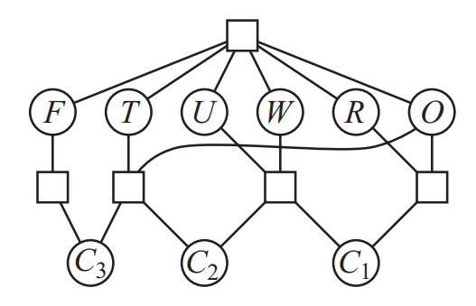

# Constraint Satisfaction Problems (CSPs)
A set of objects which must **satisfy a number of constraints**.

**Factored representation** of each state:
* set of variables each with a vlue

Problem is solved when the value of **each variable satisfies** the contraints upon it.

## Formal Definition
 * *X* = a set of variables -> {X1,...Xn}
 * *D* = a set of domains -> {D1,...Dn}
    * One domain for each variable
    * A domain = a set of **allowable values** for variable *Xi*
* *C* = a set of constraints that specify allowable combinations of values
    * A constraint = *<scope, rel>*
    * *scope* = tuple of variables that can participate in the constraint
    * *rel* = relation that defines the values those variables can take
    * i.e. if *X1* and *X2* have domain *{A,B}*:
        * Constraint *<(X1,X2), [(A,B), (B,A)]>* OR *<(X1,X2), X1 != X2)>*
        * Means the variables X1,X2 must have **different values**

* Each state = an **assignement** of values to *some or all* of the variables:
    * *{X1=v1, Xj=vj},...*
* Partial assignment = assignment that assigns values to only some of the variables
* Consistent or legal assigment = assignment that does not violate any constraints
* Complete assignment = assignment in which every variable is assigned
* **Solution to CSP** = consistent, complete assignment.

## Constraint Graph
* Nodes = variables of the problem
* Edges connected any two variables that participate in a constraint
* Requires a binary CSP

## Constraint Hypergraph
* Ordinary nodes = variables in the problem
* Hypernodes = n-ary constraints (squares)

## Constraint Types
* *Unary* constraint = restricts the value of a single variable
    * i.e. *<(SA), SA!=green>*
* *Binary* constraint = relates two variables
    * i.e. *SA!=NSW*
    * Binary CSP consists of only binary constraints
        * Can be represented as a constraint graph
* *Global* constraint = involves an **arbitrary** number of variables
    * Not necessarily all variables
    * Common example type is **Alldiff**:
        * All variables involved in constraint must have different values
        * Sudoku uses this for rows/columns/3x3 boxes
* *Preference* constraints = indicate preffered solutions
    * Encoded as costs on individual variable assignments
    * SA would prefer not to be green so if *SA=green*, add 2 points against the overall objective function instead of 1
    * Produces a **constraint optimization problem**, solved using optimization search methods
        * path-based or local