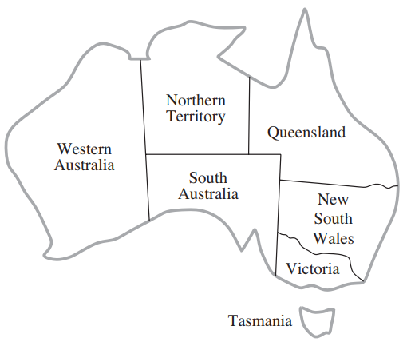
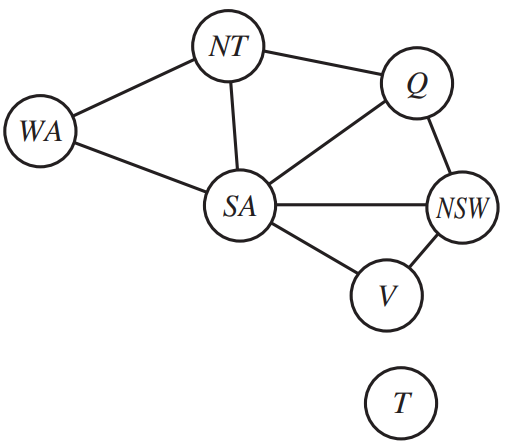

# Map Coloring 
Assigning a color to each region of a map in such a way that no neighboring regions have the same color

Can only use red, green or blue in this example.

* *X = {WA, NT, Q, NSW, V, SA, T}*
* *Di = {red, green, blue}*
* *C = {SA!=WA, SA!=NT, SA!=Q, SA!=NSW, SA!=V, WA!=NT, NT!=Q, NSW!=Q, NSW!=V}*
    * Abbreviations, i.e. *SA!=WA = <(SA,WA), SA!=WA>*

Constraint Graph:

