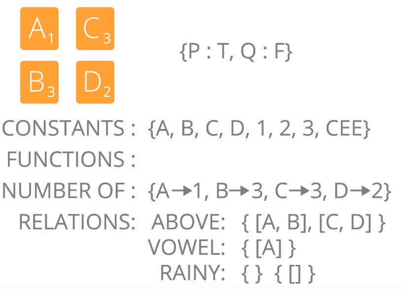

# First Order Logic
Relations are on **objects**, not on relations.
More expressive form of logic than propositional logic.
## Models

* Set of Objects
* Constants
    * Refer to objects
    * Doesn't need to be 1-1 correspondance between objects and constants
        * Could have 2 different constants referring to same object
* Functions
    * Function = Mapping from objects to objects
* Relations

## Syntax
### Sentences - facts that are T/F
* **Atomic** Sentences
    * Predicates corresponding to relations
    * Vowel(A)
    * 2 = 2
        * Distinguished, equality relation
* **Complex** Sentences
    * Atomic sentences combined using logical operators/connectives
### Terms - describe objects
* Constants
    * *A, B, 2*
* Variables
    * *x, y*
    * Conventionally lowercase
* Functions
    * Number of (A)
### Quantifiers
* Universal Quantification - &forall;
    * For all, for any, for each
    * *&forall;x Vowel(x)&rarr;Number of (x) = 1* 
        * For all x, if x is a Vowel then the number of x is equal to 1
    * Often followed by a **conditional**
        * Usually don't want to make a statement about *every* object in the domain -> objects can all be very different
* Existential Quantification - &exist;
    * There exists
    * *&exist;x Number of (x) = 2*
    * There exists an x, such that the number of x is equal to 2. But not saying what that x is
    * Often **not** followed by a conditional:
        * Usually describing a single object

## Vacuum World Example

* Locations: 
    * A = left location
    * B = right location
    * V = vacuum location
* Dirt:
    * D1
    * D2
* Relations:
    * Loc
        * True of any location
    * Vacuum
        * True of the vacuum
    * Dirt
        * True of dirt
    * At (0,l)
        * True if o at location l

* Vacuum at location A:
    * At(V, A)
* No dirt at any location:
    * &forall;d &forall;l Dirt(d) &and; Loc(l) &rarr; ¬At(d,l)
* Vacuum is in a location with dirt:
    * &exist;l &exist;d Dirt(d) &and; Loc(l) &and; At(V,l) &and; At(d,l)
    * Don't need to specify the location

## Valid, Satisfiable, Unsatisfiable Examples
* &exist;x,yx x=y
    * **Valid**
    * Every model has to have at least one object, x,y can both refer to the same object -> equal to itself
* (&exist;x x=x) &rarr; (&forall;y &exist;z y=z)
    * **Valid**
    * LHS has to be true, x is always equal to x
    * RHS -> can always choose y itself for the value of z
    * Therfore true implies true
* &forall;x P(x) &or; ¬P(x)
    * **Valid**
    * Everything has to be either in the relation for P or out of the relation for P
* &exist;x P(X)
    * **Satisfiable**
    * True for models where there exists an x that is a member of P
    * Not all models will contain such an x

## Sentece/Axiom Examples
* Sam has two jobs:
    * &exist;x, y Job(Sam,x) &and; Job(Sam,y) &and; ¬(x=y)