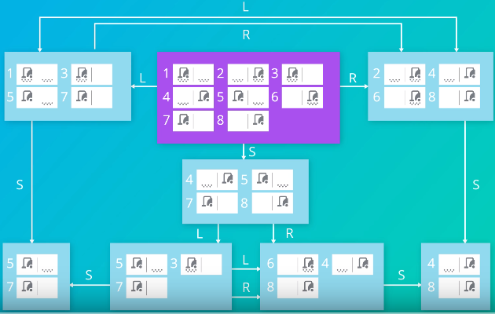
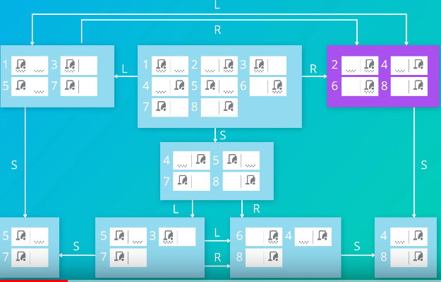
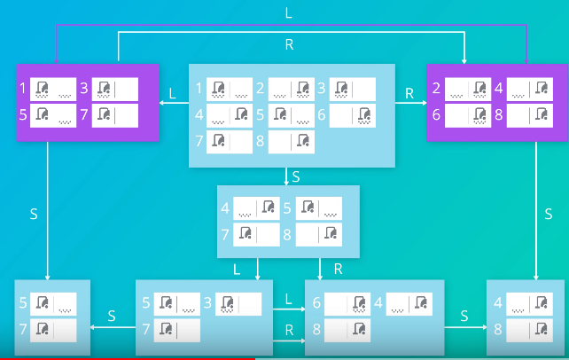
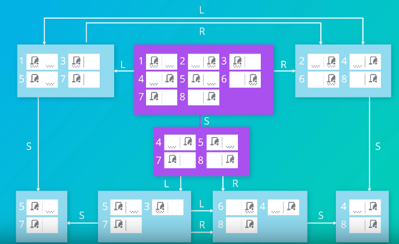
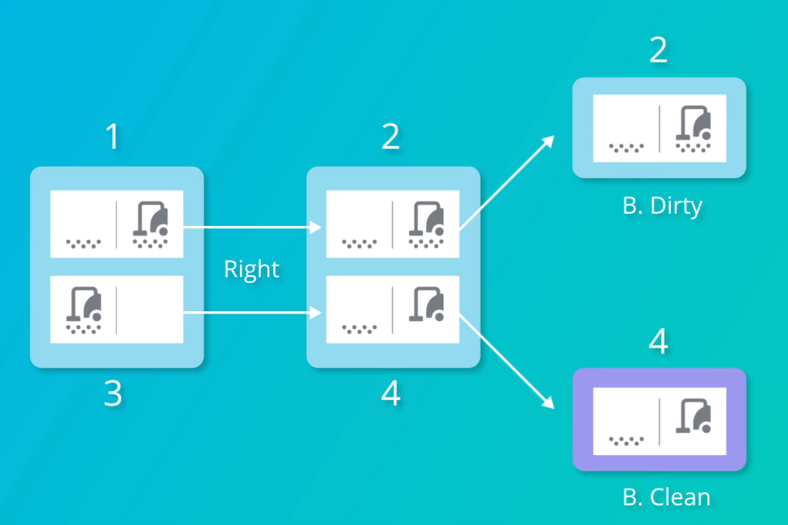
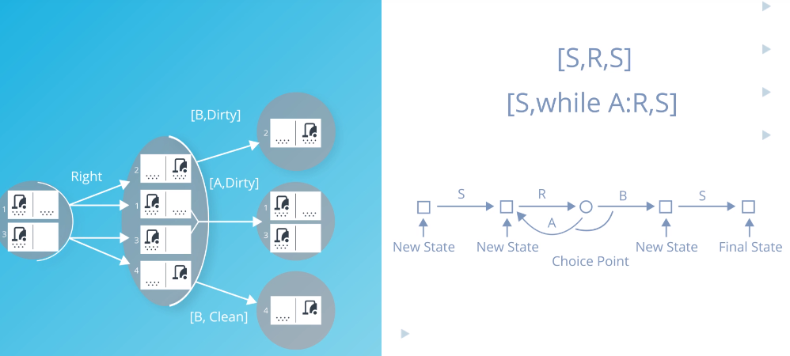
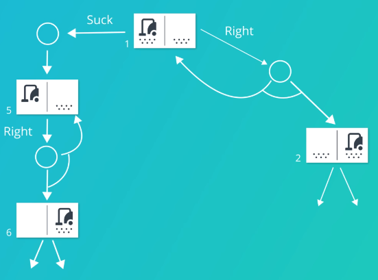
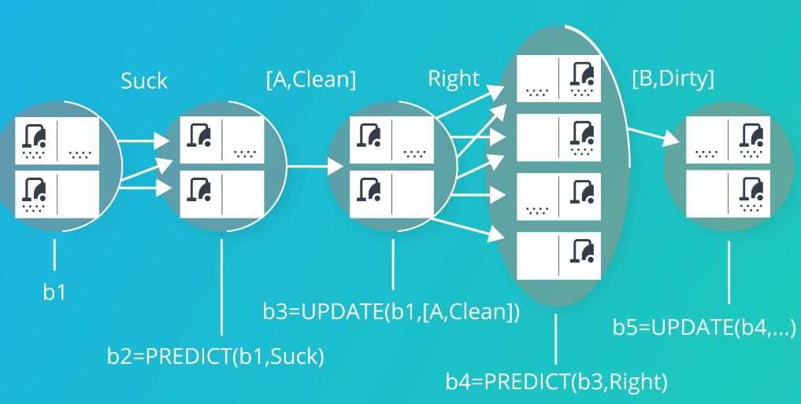
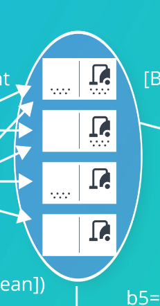

# Planning

## Problem Solving vs Planning
* Problem solving searches for a path through a state space from a start state to a goal state
* Then blindly executes that path
    * No interaction with the environment during execution
* Need to **interweave planning** a path and exeuction of the path
    * Properties of the environment make the planned path difficult to deal with 
    * Take inputs from environment during execution and 'react' accordingly
* Example: blind folded people walking in straight line:
    * Blind folded so can only see own feet/a metre in front
    * Plan/Path is to walk in a straight line
    * On overcast/cloudy days, people couldn't walk in a straight line
    * On sunny days, people walked in a much straighter line using shadows to guide them

## Planning vs Execution
Environment will affect execution of a plan:
* Stochastic
    * Have to deal with contigencies of action results
    * i.e. drive forward, wheel slips, brakes skidding, red traffic light makes go forward through intersection action different to if it was green
* Multiagent
    * React to unexpected actions of other agents
    * Can only do at execution time
* Partial Observability
    * Don't know complete state until the agent 'gets' there
    * Driving on path [A,S,F,B], S may have roadworks but agent won't know until it reaches S

Lack of knowledge:
* Unkown model
    * Incomplete map
* Heirachical actions
    * Only high level parts of 'plan' are known to begin with
        * Drive the path [A,S,F,B]
    * Low level detail is done during execution
        * Engage accelerator, brake at traffic lights, turn steering wheel etc

## Belief States
**Overcome** above difficulties by **changing point of view**:
* Plan in a **space of belief states** instead of a space of world states
* Belief state = the agent knows it is in **one of a set** of possible physical states

## Conformant/Sensorless Planning in Deterministic world 
Search problem with **no observations** and result of actions are known
* Must use belief states
* Agent gains knowledge about world without sensing by **executing actions**

### Sensorless Vacuum
Belief state space:
* Start in purple belief state
    * Agent knows it is in one of 8 states

* If Agent moves right, it gains knowledge about its state:
    * Either it was in a left position and moved to right or was already in right position and stayed there
    * Now has 4 possibilities for state, without sensing anything

* Now moving left does not **inverse** the first action
    * Moves to a complete left position state, not back to middle state

Can reach a goal state without ever sensing - **conformant problem**:
* If goal =  be in clean location, all have to do is **suck**
    * Conformant plan
    * Agent doesn't know **which** location it is in, but it knows it must be clean

## Partially Observable Planning in Deterministic World
Search problem with **some observations** and result of actions are known
* Belief states can 'unfold' into known states using limited observations
* i.e. local sensing - agent can observe its current location but not others in the state

### Partially Observable Vacuum
Vacuum has Local sensing:
* Can see what location it is in (L/R)
* Can see what is going on in current location (Clean/Dirty)
* **Cannot** see whether there is dirt in any other locations

Use **act-observe cycle**
* Do an action, then observe to 'split' the belief state 

* Act by moving right
* Observe to determine whether the current location is clean or not

## Stochastic Environments
* Outcome of actions are **not known**
* Represent plans by a **tree structure with choice points**
    * Infinite sequences
    * A choice point allows the plan to 'go back adn try an action again' if the outcome of an action was not successful to move to the next state
* i.e. Vacuum cleaner wheels might slip when moving - leaving it in the same location

* Search through the tree until a portion of the tree is found which is successful
    * The 'portion' including choice points is the plan

* Guarantee an **unbounded** solution:
    * **Every leaf** node is a goal
    * Always find a solution in an unknown number of steps
* Guarantee a **bounded** solution:
    * **No loops** in the tree
    * Always find a solution within a finite number of steps

## Mathematical Notation
* Deterministic world:
    * New state is simply result of an action
        * s1 = Result(s,a)
    * Is the end state a goal state?
    * [A,S,F]: 
        * Result(Result(A,A&rarr;S),S&rarr;F) &larr; Goals
* Stochastic, partially observable:
    * Belief states, not individual states
    * New belief state = result of Updating the result of predicting what an action will do, then updating based on observation of the world.
    * b1 = Update(Predict(b,a),o)
        * Predict = start off in belief state, look at each possible of the result of an action
        * Update by taking into account an observation
    * Use predict-update cycle to track where agent is in belief state

    

    * Belief states can get very big
        * Divide into variables describing state to overcome:
        * Could be represented by variable saying 'vacuum is on right':
        
        