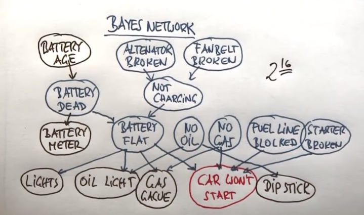

# Bayes Networks (Nets)
* Probabilistic directed acyclic graphical model that represents a set of variables and their conditional dependencies via a directed acyclic graph
    * Compact represntation of a distribution over a very large joint probability distribution of variables

* Assume **binary events**