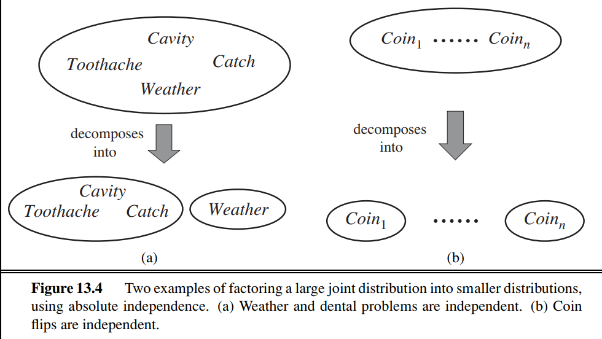

# Probability Theory
Solves the **qualification problem** by providing a way of **summarizing** the uncertainty that comes from laziness and ignorence
* Laziness: Too much work to list the complete set of preconditions
* Theoretical ignorance: A complete theory for the domain may not exist
* Practical ignorance: May not be possible to determine values for all preconditions in a real scenario

**Axioms of Probability** = for any Propositions A, B:
* 0 <=P(A)<=1
* P(True) = 1 and P(False) = 0
* P(A&or;B) = P(A)+P(B)-P(A&and;B)

**Sample Space** = set of all possible worlds
* Represented by **&Omega;**
* **&omega** refers to elements of the space - particular possible worlds

**Probability Model** =  Associates a probability *P(&omega;)* with each possible world
* *0<=P(&omega;)<=1 for every &omega; and &sum;&omega;&isin;&Omega;P(&omega;)=1*

**Events** = sets of worlds interested in, represented by propositions
* Corresponding set for a proposition contains just the possible world in which the proposition holds
* For any proposition *&phi;, P(&phi;) = &sum;&omega;&isin;&phi;P(&omega;)*

**Prior/Unconditional Probabilities** = probabilities referring to degrees of belief in propositions in the absence of any other evidence/information

**Evidence** = Further information from other observations

**Conditional/Posterior Probability** = probability taking into account relevant observations

**Random Variables** = variables in probability theory
* Names begin with uppercase letter

**Domain** = set of possible values a random variable can take on

**Probability Distribution** = Probabilities of all the possible values of a random variable
* Dentoted by bold **P**
* **P**(Weather) = <0.6,0.1,0.29,0.01>
    * Assume pre-defined ordering: <sunny, rainy, cloudy, snow>

**Conditional Distributions** = Probability distributions for conditional probabilities
* **P**(X|Y) = P(X=xi|Y=j) for each possible i,j pair

**Probability Density Function** = Function, whose value at any given sample in the variables domain can be interpreted as providing a relative likelihood that the value of the random variable would equal that sample
* P(NoonTemp=x) = Uniform[18C,26C](x)
    * Expresses belief that the temperature at noon is distributed uniformly between 18 and 26 deg Celsius

**Joint Probability Distribution** = Probabilities of all combinations of possible values for the random variables included
**P**(Weather, Cavity) denotes probabilities of all combinations of the values of Weather and Cavity

**Possible World** = assignment of values to all of the random variables under consideration

**Marginilization/Summing out** = Safely 'ignore variables' by summing up the probabilities for each possible value of the other variables, thereby taking them out of the equation
* **P**(**Y**)=**&sum;z&isin;ZP**(**Y**,**z**)
* &sum;z&isin;Z = sum over all the possible combinations of values of the set of variables Z

**Conditioning** = Marginilization using conditional probabilities
* **P**(**Y**)=**&sum;z&isin;ZP**(**Y**|**z**)P(**z**)

**Normalization** = Reducing a probability function to a probability density function with a **toal prbability of 1**

**normalizing constant** = value denoted by &alpha; used to normalize a probability function
* Can calculate **P**(A|B) without knowing P(B):
    * Add up values for P(A) and P(¬A) - give correct proportions
    * Normalize by dividinbg each one by Sum(P(A)andP(¬A))
* **E** = list of evidence variables, **e** = list of observed values for evidence variables and **Y** = remaining unobserved variables:
    * **P**(X|**e**) = &alpha;**P**(X,**e**)=&alpha;**&sum;yP**(X,**e**,**y**)
    * Summation is over all possible **y**'s (possible combinations of values of the unobserved variables **Y**)
    * **P**(X,**e**,**y**) = a subset of probabilities from the full joint distribution
        * X, **E** and **Y** are complete set of variables for the domain

**Independence** = Occurence of one event does not affect the probability of occorence of the other
* Represented as:
    * **P**(X|Y) = **P**(X)
    * **P**(X|Y) = **P**(Y)
    * **P**(X,Y)=**P**(X)**P**(Y)
* Usually based on knowledge of the domain
* 
* Rare to get clean separation of entire sets of variables by independence

**Conditional Independence** = two events X and Y give a third event Y if the occurence of X and the occurence of Y are independent events in their conditional probability distribution give Y
* X and Y are conditionally independent given Y iff given knowledge that Y occurs, knowledge of whether X occures provides no information on the likelihood of Y occurring and knowledge of whether Y occurs provides no information of the likelihood of X occuring
* **P**(X,Y|Z) = **P**(X|Z)**P**(Y|Z)
* **P**(X|Y,Z)=**P**(X|Z)
* **P**(Y|X,Z)=**P**(Y|Z)

**Decision theory** = probability theory + utility theory
* Utility theory = every state has a degree of usefulness (utility) to an agent and the agent will prefer states of higher utility
* Decision theory states an agent is rational IFF it chooses the action that yields the highest expected utility, averaged over all the possible outcomes of the action
* **Maximum Expected Utility**
* Average of the outcomes weighted by the probability of the outcome
* Decision-theoretic agent belief state represent possible states for the world **and their probabilities**
