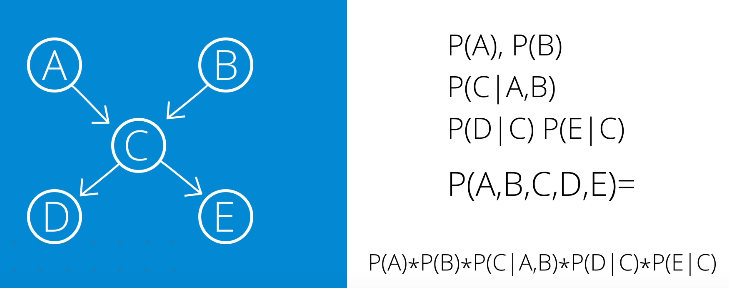
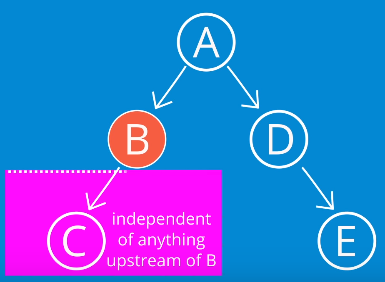
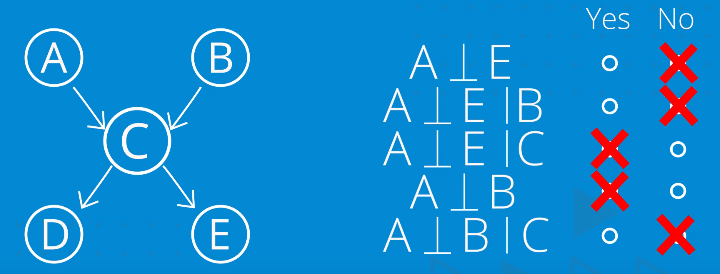
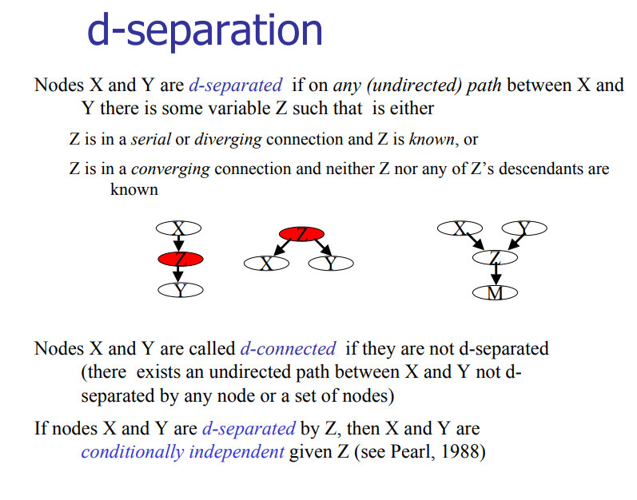

# Bayes Networks
Define probability distributions over graphs of random variables

Only uses distributions that are inherent to individual nodes
* Instead of enumerating all possibilities

Probability of each **node is conditioned only on it's incoming arcs**:

Computes far fewer values for joint distribution than the combinatorial approach - for the **graph above**:
* Combinatorial:Joint Distribution over 5 variables = 25-1=**31 values**
* Bayes: Required values for calculating the joint distribution:
    * P(A) = 1
    * P(B) = 1 
    * P(C|A,B) = 4
        * Derived using a distribution of C condition on any combination of A and B, of which there are 4 (22)
    * P(D|C) = 2
        * Derived from distribution of D condition on possible values of C (i.e. C and ¬C)
    * P(E|C) = 2
        * Derived from distribution of E condition on possible values of C (i.e. C and ¬C)
    * Total = **10 values**
 ## D-Separation
 Any two variables are independent if they're not linked by just unkown variables
 * If we **know B**:
    * 
* Knowledge of a variable C renders previously independent variables dependent:
    * 

