# Probabilistic Inference in Bayes Networks
## Types of Variables:
* **Evidence** = Variables with known values
* **Query** = Variables we want to find the value of
* **Hidden** = *neither* evidence or query variable

**Not restricted to one direction**
* i.e following arrows/relations from top to bottom
    * Basic input-output used in normal functions
* Can use any combination of nodes as evidence and query

### Example
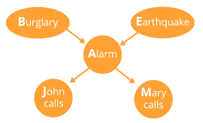

Ex1: Mary has called to report the alarm is going off, we want to know whether there has been a burglary:
* B = Query
* E = Hidden
* A = Hidden
* J = Hidden
* M = Evidence

## Inference Tasks
**Posterior Distribution** = Complete joint probability distribution over the query 
variables
* Answer to a query
* P(Q1,Q1...|E1=e1,E2=e2)

**Most likely explanation** = Out of all possible values of query and evidence variables, which combinatino has the highest probability?
* argmaxq P(Q1,Q1...|E1=e1,...)

## Enumeration
Goes through all possibilities and adds them up to produce an answer
1. Take a conditional probability
2. Write as unconditional probabilities
3. Enumerate all atomic probabilities
4. Calculate sum of products

### Notation
Not universal rule, but for clarity here:
* P(E=true)=P(+e)=1-P(¬e)=P(e)
* Going to use P(+e) and P(¬e) to distinguish true/false and variables

### Example
Bayes net and conditional probability tables:
* 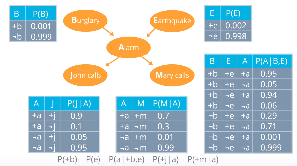

1. P(+b|+j,+m)
2. = P(+b,+j,+m)/P(+j,+m)
3. Process for numerator (same for denominator):
*  P(+b,+j,+m) = &sum;e&sum;a P(+b,+j,+m,e,a) 
    * Enumerate all possible values of hidden variables
* = &sum;e&sum;a P(+b)P(e)+P(a|+b,e)P(+j|a)P(+m|a) = f(e,a)
    * Call product f(e,a)
4. P(+b,+j,+m) = sum of f(e,a) for all values:
    * = f(+e,+a)+f(+e,¬a)+f(¬e,+a)+f(¬e,¬a)
    * For +e, +a:
        * P(+b)=0.001
        * P(+e) = 0.002
        * P(a|+b,e) = 0.95
        * P(+j|a) = 0.9
        * P(+m|a) = 0.7
        * Therefore f(a=+a,e=+e) = 0.001&middot;0.002&middot;0.95&middot;0.9&middot;0.7 = **0.000001197**
    * Repeat for combinations of e,a then sum up
* Repeat for denominator
* Calculate final value

### Speeding Up Enumeration
Computational cost increases massively with problem size:
* 27 boolean variables = > 100 million values
* Variables aren't necessarily boolean so could grow even faster

#### Pulling Out Terms
Reduces cost of inner loop of the summation.

 Move terms which are the same for all values in the enumeration outside and multiply at the end:
* &sum;e&sum;a P(+b)P(e)+P(a|+b,e)P(+j|a)P(+m|a) = f(e,a)
* = P(+b)&sum;e&sum;aP(e)+P(a|+b,e)P(+j|a)P(+m|a)
    * P(+b) is the same for both &sum;e and &sum;a
* P(+b)&sum;eP(e)&sum;a+P(a|+b,e)P(+j|a)P(+m|a)
    * P(e) only changes in &sum;e not &sum;a

Reduces the cost of each 'row' in the computation, but doesn't reduce the number of rows.

#### Maximize Independence (Causal Direction)
Restructure the Bayes net to maximise the number of independent variables

Structure in **causal direction**:
* Network flows from causes to effects
* Maximizes independence
    * Reduces unecessary dependency relationships

Causal Direction for the example above:

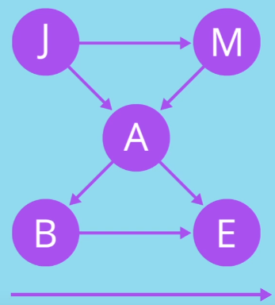

## Inference by Variable Elimination 
**Faster than inference by enumeration** in most practical cases

Uses an algebra for manipulating **factors**
* factors = multi-dimensional arrays produced by the probabilistic terms

Each table is a factor:
* R = Rain
* T = Traffic
* L = Being late

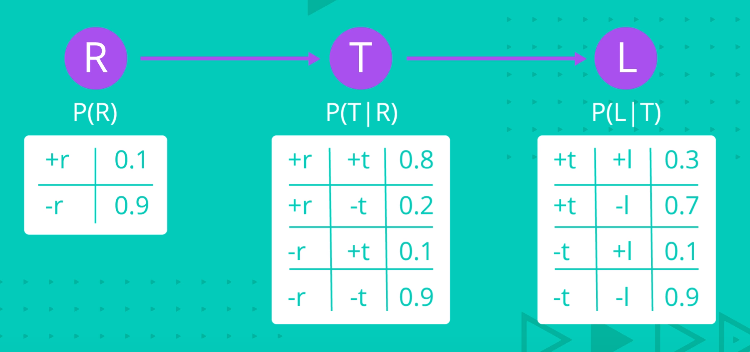

Combines together parts of the network into smaller parts and then enumerate over smaller parts and continue combining
* Start with big network, eliminate some variables, compute by marginalizing out - giving a smaller network to deal with
* Repeat 

### Joining Factors
1. Choose two or more factors
2. Combine to form a new factor representing the **joint probability of all the variables in the factor**
    * Look up in corresponding tables and multiply together

From above example:
* First row = +r, +t = P(R=+r)&middot;P(T=+t|R=+r) = 0.1*0.8 = 0.08
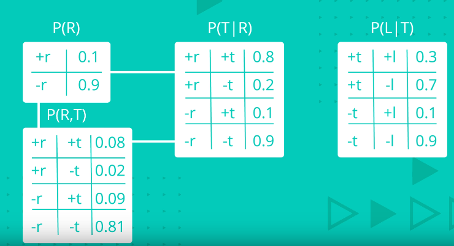

This gives a new factor in the existing network:

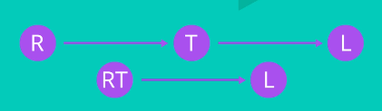

### Elimination/Summing out/ Marginalization
Reduce size by 'ignoring' a variable
* P(B=b) = &sum;aP(A=a,B=b)
    * Marginilizes out the variable **A**

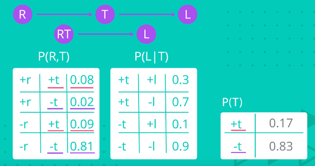

Gives:

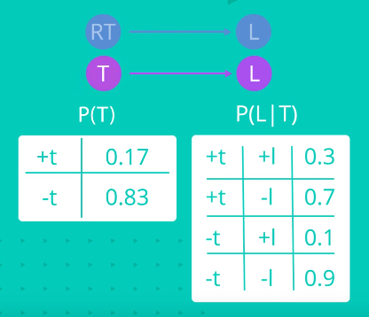

### Repeat
Join factors again:

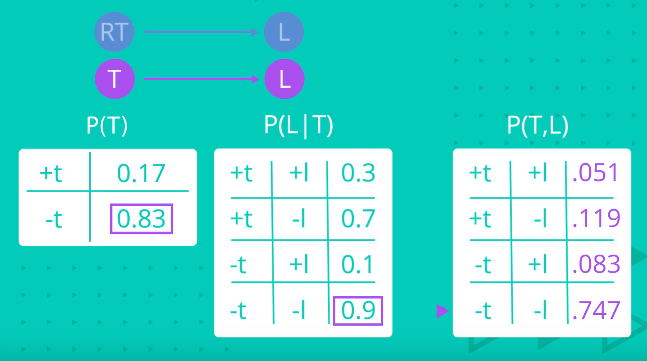

Sum Out again to give just Node with L:

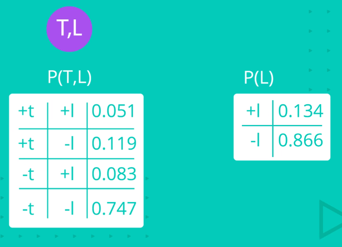

## Approximate Inference by Sampling
Sample the process to estimate the joint probability distribution
* Small number of samples = innacurate - random variation that causes not to converge on true values
* Large number of samples = closer to true distribution

Gives a procedure for coming up with an approximation of the probability distrubution **without complex computation**

Can be used if **conditional probability tables are not known**.
* Process can be simulated
* Estimation can be produced

### Sampling from an Empty Network
Produces **consistent** estimates

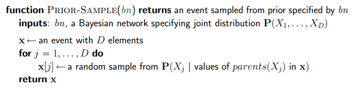

### Rejection Sampling
Estimated **P**(X|**e**) from samples **agreeing with e**

**Consistent posterior** estimates

**Very expensive if P(e) is small**
* Will reject many samples
* **P**(**e**) drops off exponentially with number of evidence variables 

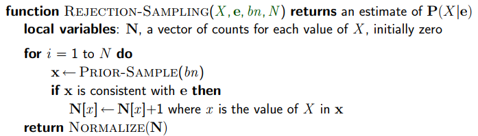

#### Example
Estimate **P**(Rain|Sprinkler=true) using 100 samples:

* 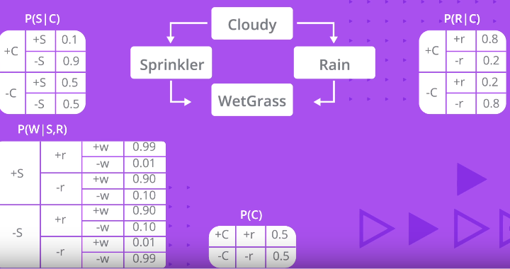

* 27 samples have Sprinler=true:
    * 8 have Rain=true
    * 19 have Rain=false
* Estimated **P**(Rain|Sprinkler=true)=Normalize(<8,19>)=<0.296,0.704>

### Likelihood Weighting
**Fix** evidence variables, sample only nonevidence variables and **weight**  each sample by the likelihood it accords the evidence
* Example of general statisctical technique **importance sampling**

Avoids inefficiency of rejection sampling by generating only events that are consistent with the evidence **e**

**Consistent** estimates

Performance **degrades with many evidence variables**
* A few samples have nearly all the total weight

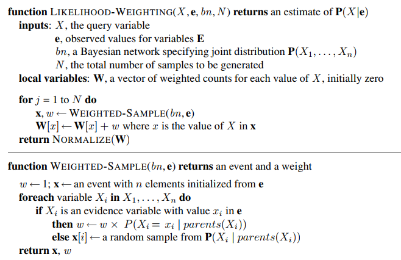

**Likelihood** that an event accords the evidence = product of the conditional probabilities for each evidence variable, given its parents
* Events where the actual evidence is unlikely are given less weight

### Gibbs Sampling (MCMC)
Takes all evidence into account
* Not just *upstream* evidence

**Markov Chain Monte Carlo** (MCMC)

Resample just one variable at a time, conditioned on all the others

**State** of network = current assignment to all variables

Generate **next state** by sampling one variable given Markov blanket

**Consistent** estimates

Sample each variable in turn, keeping evidence fixed
* Can also choose a random variable to sample each time

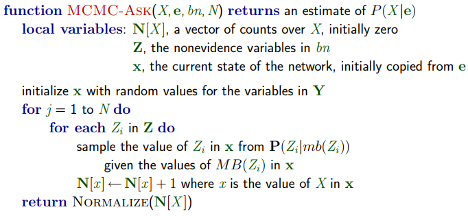

Initialise random values (evidence values fixed):

Select a **non-evidence** variable and re-sample (choosing +s):

Repeat choosing -r:

etc