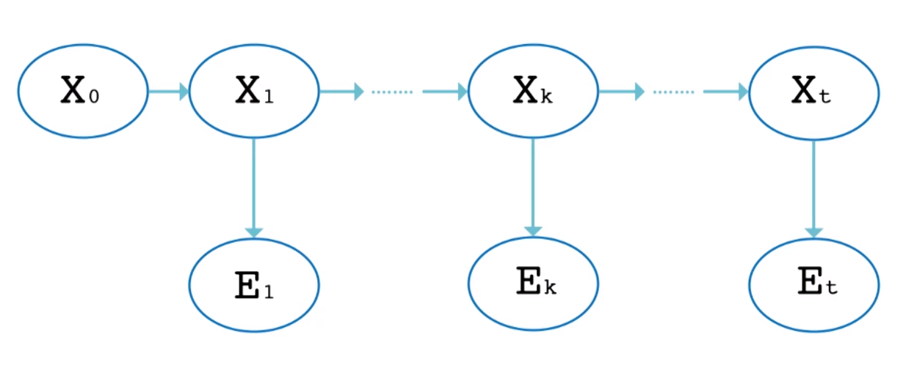

# Hidden Markov Models
**Markov model** = stochastic model used to model randomly changing systems
* Future states depend **only on the current state**
    * The **Markov property**
* Enables reasoning and computation in models which are often intractable when considering a history of state

**Hidden Markov Models(HMM):**

Markov chain for which the state is only partially observable
* Don't know which state matches whic physical event
* Each state yields certain outputs
* Observe output over time and produce a sequence of states based on how likely they are to produce the outputs

## HMM Representation

* Each Xi = frame of data (state)
* Each Ei = output at time frame 