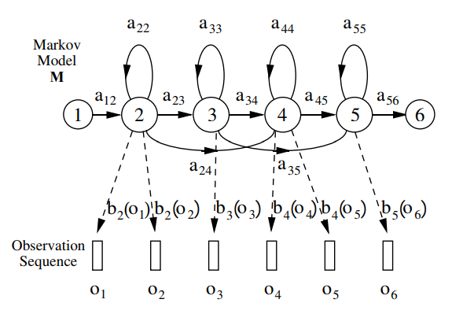
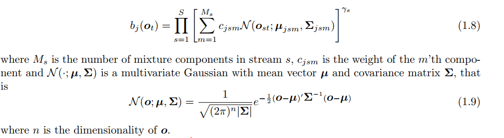
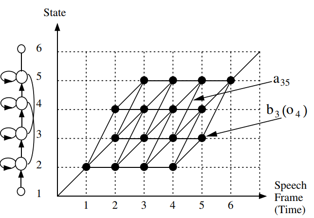
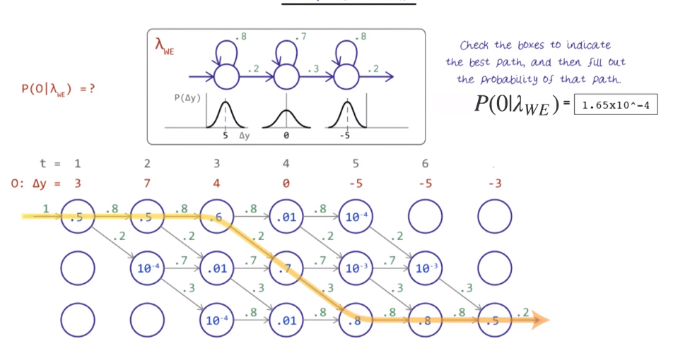

# Hidden Markov Models
Markov model for which the state is only partially observable
* Only observation sequence **O** is known
* Don't know which state matches which physical event
    * Underlying state sequence is hidden
* Each state yields certain outputs
* Observe output over time and produce a sequence of states based on how likely they are to produce the outputs

## Parameters
* **Xt** = discrete random variable with **N** possible values
* Transition matrix = A= {aij}=P(Xt|Xt-1=i)
* Initial state distribution = &pi;i=P(X1=i)
* Observation variables Ot take one of *K* possible values
* Probability of observation at time *t* for state *j* = bj(ot)=P(Ot=ot|Xt=j)
* All values of Ot and Xt give matrix B={bj()vk}
    * *N*x*K* matrix
* Observation sequence = **O** = (O1=o1,O2=o2,...OT=oT)
* HMM = &theta;(A,B,&pi;)

## HMM Representation
Markov Generation Model:

Left to right representation:

* Each Xi = frame of data (state)
* Each Ei = output at time frame 

## Output Probability Distributions
Output Distributions = {bj(**o**t)}
* Continuous density distributions
    * For observation sequences with discrete symbols they are discrete distributions

Often represented by **Gaussian Mixture Densities**
* 
* &gamma;s = stream weight
    * Can be used to give a particular stream more emphasis

## HMM Problems
1. Evaluation: Given an observation sequence and a model, efficiently compute the probability of the obesrvation sequence, given the model:
    * Observation sequence O=O1,..., OT
    * Model = &lambda;(A,B,&pi;)
    * P(O|&lambda;)
2. Given an observation sequence and model, choose a corresponding **state sequence** which is optimal in a meaningful sense
    * Explains the observations
3. **Adjust model parameters** to maximise P(O|&lambda;)

## Viterbi Algorithm
Find the single best state sequence for the given observation sequence

Computes maximum likelihood state sequence:
* &phi;j(t) = maximum likelihood of observations **o**1 to **o**t and being in state *j* at time *t*
* Recursive:
    * &phi;j(t)=maxi{&phi;i(t-1)aij}bj(**o**t)
    * Where:
        * &phi;1(1) = 1
        * &phi;j(1)=a1jbj(**o**1)
    * Max likelihood P(O|M) = &phi;N(T)=maxi{&phi;i(T)aiN}
    * For i < j < N and model M
* Use **log likelihoods** to avoid **underflow**:
    * &phi;j(t)=maxi{&phi;i(t-1)log(aij)}+log(bj(**o**t))

Finding the best path through a matrix where:
* Vertical dimension = states of the HMM
* Horizontal dimension = frames of time

Example for isolated word recognition:

* Dots = log probability of observing a frame at that time
* Arcs = log transition probabilities
* Log probability of any path is the sum of the log transition probabilities and the log output probabilites along the path.
* Paths grown left->right, column by column
* At each time *t*, each **partial path** &psi;i(t-1) is known for all states **

### Example
Recognising a 'We' gesture in sign language

## Baum-Welch Re-Estimation
Increase accuracy (maximum likelihood) of the parameters in the model, given a set of observed features.
* Local maximum for &theta;*=argmax&theta;P(Y|&theta;)
* HMM parameters &theta; that maximise the probability of the observation

Uses **Expectation Maximization**

### Algorithm
Set &theta;=(A,B,&pi;) with random initial conditions or good estimates using prior information if possible

#### Forward Procedure
&alpha;i(t)=P(O1=o1,...,OT=ot,Xt=i|&theta;)
* Probability of seeing o1,...ot observation sequence and bing in state *i* at time *t*

Found recursively:
1. &alpha;i(1)=&pi;ibi(o1)
2. &alpha;i(t+1)=bi(yt+1)&sum;j=1N&alpha;j(t)aji

#### Backward Procedure
&beta;i(t)=P(Ot+1=ot+1,...,OT=ot|Xt=i,&theta;)
* Probability of the ending partial sequence ot+1,...,oT given starting state *i* at time *t*

Found recursively:
1. &beta;i(T)=1
2. &beta;i(T)=&sum;j=1N&beta;j(t+1)aijbj(ot+1)

#### Update
&gamma;i(t)=P(Xt=i|O,&theta;)=P(Xt=i,O|&theta;)/P(O|&theta;)=&alpha;i(t)&beta;i(t)/&sum;j=1N&alpha;jj(t)&beta;jj(t)
* Probability of being in state *i* at time *t* given observed sequence *O* and parameters &theta;
* Bayes theorem

&epsilon;ij(t)=P(Xt=i,Xt+1=j|O,&theta;)=P(Xt=i,Xt+1=j,O|&theta;/P(O|&theta;) = &alpha;i(t)aij&beta;j(t+1)bj(ot+1)/&sum;i=1N&sum;j=1N&alpha;ij(t)aij&beta;j(t+1)bj(ot+1)
* Probability of being in state *i*  and *j* at times *t* and *t+1* respectively, given observeration sequence *O* and parameters &theta;

Denominators of &gamma;i(t) and &epsilon;ij are **the same**
* Probability of making the observation *O* given parameters &theta;

Update paramaters of HMM:
* &pi;*i= &gamma;i(1)
    * Expected frequency spent in state *i* at time 1
* a*ij=&sum;t=1T&epsilon;ij(t)/&sum;t=1T-1&gamma;i(T)
    * Expected number of transitions from state *i* to state *j* compared to the expected total number of transition away from state *i* (transitions to any state including itself)
* b*i(vk)=&sum;t=1T1yt=vk&gamma;i(t)/&sum;t=1T&gamma;i(t)
    * Where 1yt=vk is an **indicator function**:
        * 1 if yt=vk
        * 0 otherwise
    * Expected number of times the ouput observations have been equal to vk while in state *i* over the expected total number of times in state *i*
* Steps repeated iteratively until desired convergence is reached

Note: **Does not guarantee a global maximum**