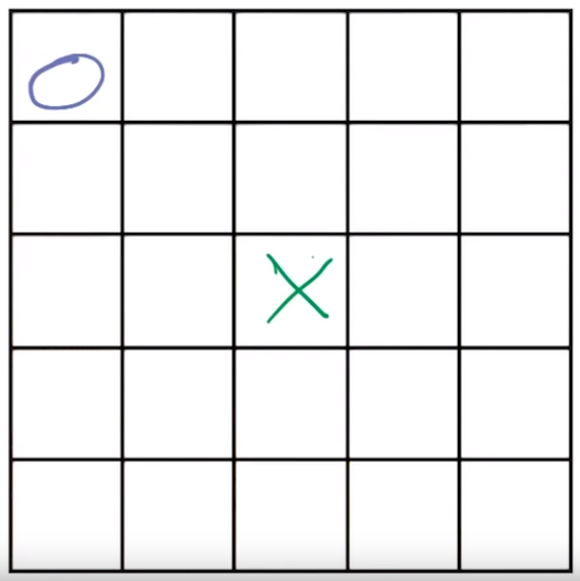
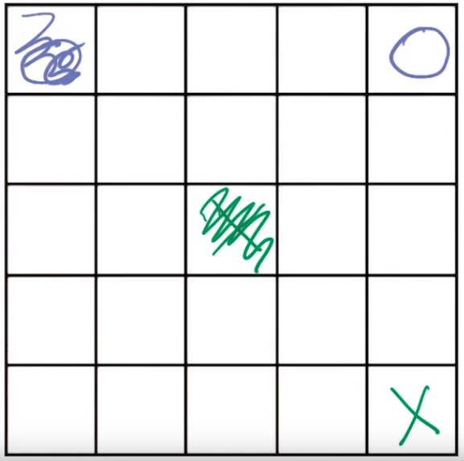
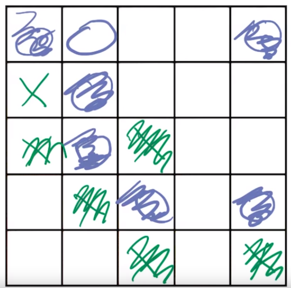

# Isolation Game
The aim of the game is to trap your opponent.

Game begins by each player placing their piece wherever they like on the board:

Players can now move their pieces to any sqaure along a row, column, or diagonal:

Each square can **only be visited once**. This is how players attempt to trap each other. Here, 'X' has been trapped and therefore loses the game: 

