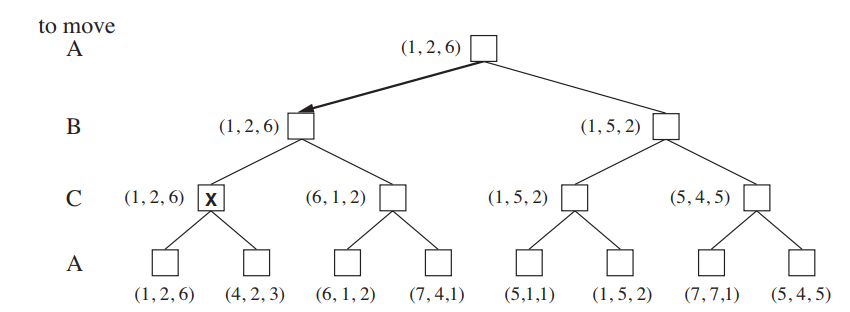
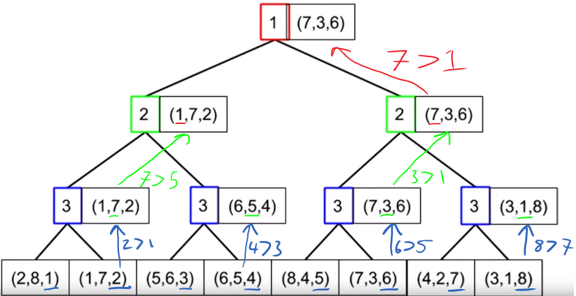
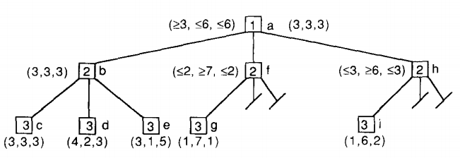

# Multiplayer Games and MAXN
* Game-tree alternates between all player turns, not just MAX and MIN:



* MINIMAX nodes are now **vectors** or tuples of values for each player:
    * Players A,B,C -> vector [v<sub>A</sub>,v<sub>B</sub>,v<sub>C</sub>] for each node
* Terminal State, vector = **utility** of state for each player
* Nonterminal state = backed up value of node *n* is always the utility of the successor state with the highest value **for the player choosing at *n***:



## MAXN Alpha-Beta
* Requires:
    * Upper bound on **sum of all components** of a node tuple
    * Lower bound on values of each component

### Immediate Pruning
* Player *i*'s turn:
    * Prune remaining children If *i*th component of a child == upper bound of component sum
        * No child's *i*th comonent can be > upper bound of component sum.

### Shallow Pruning



* Also includes immediate pruning as special case:
    * `If Best[Player]>=Bound: return Best`
```
Sum = global upper bound on sum of components in an N-tuple

function Shallow(Node, Player, Bound) returns maxn N-tuple of node
If TERMINAL-TEST(Node):
    return Utility(Node)
    Best = Shallow(first Child, next Player, Sum)
    for each remaining Child:
        If Best[Player] >= Bound: # immediate pruning case
            return Best
        Current = Shallow(Child, next Player, Sum-Best[Player])
        If Current[Player] > Best[Player]:
            Best = Current
return Best
```