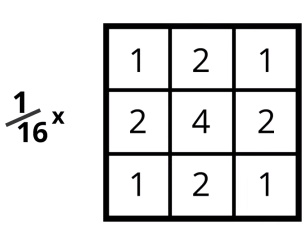

# Filters

Methods for detecting/manipulating different features/traits in an image.

* Filter out unwanted information
* Amplify features of interest

## Frequency in Images

**Rate of change** in intensity.

* Similar to frequency in sound

  * High frequency sound = faster moving sound waves

* High frequency = intensity changes a lot, level of brightness changes quickly from one pixel to the next
* Low frequeny = relatively uniform in brightness


* Blue = low frequency
* Pink = high frequency

## Convolution

Process of adding each element of the image to its local neighbours **weighted by a kernel**.

**Kernel** = small matrix of weights

Each output pixel value is calculated by the sum of multiplying the surrounding pixel values with the corresponding weights in the kernel:


The kernel is 'centered' on the pixel to be calculated.

### Psuedocode

```
for each image row in input image:
    for each pixel in image row:

        set accumulator to zero

        for each kernel row in kernel:
            for each element in kernel row:
                if element position corresponding to pixel position then:
                    multiple element value corresponding to pixel value
                    add result to accumulator
                endif
        set output image pixel to accumulator
```

### Edge Handling

Corner/edge pixels won't have surrounding pixels to use:


#### **Extend**

The neares border pixels are extended as far as necessary to provide values for the convolution

* Corner pixels are extended in 90<sup>o</sup> 'wedges'
* Edge pixels are extended in lines
* OpenCV default method

#### **Wrap**

Image is wrapped/tiled -> values taken from **opposite** edge/corner

#### **Crop**

Any pixel in output image which would require values from beyond the edge is **skipped**

* Output image ends up slightly smaller that input

## High-Pass Filters

* Sharpen an image
* Enhance **high-frequency** parts of an image
* Grayscale images are effective as they show intensity well

Used for **edge-detection**

* Edges = ares in an image where intensity changes very quickly -> often indicating object boundaries


Example edge detection filter:

* 

For finding/enhancing _horizontal_ edges:

* 

## Low-Pass Filters

* Blur/smooth an image
* Block high-frequency parts of an image
  * Remove **noise**
    * Speckle/discoloration in an image
    * Contains no useful information
    * Can make processing steps worse

Averaging filter:

* 
* Weights the center pixel and its surrounding pixels the same
* Normalize to ensure the components sum to 1
  * Preserve image brightness

Gaussian Blur:

* 3x3 approximation:
  * 
* Blur/smooth image **whilst preserving edges**
* Convolves the image with a gaussian function
  * Kernel contains gaussian values
* Weighted average with higher weight given to pixels near the center of the kernel

## Canny Edge Detector

Widely used and accurate edge detection algorithm

1.  Filters out noise with Gaussian Blur
2.  Finds strength and direction of edges using Sobel filters
3.  Applies non-maximum supression to isolate strongest edges and thin them to one-pixel wide lines

* Looks at strength and direction of each detected edge and selects the local maximum pixel
* Create consistent one-pixel wide liens that are consistent with the strongest edges

4.  Uses hysteresis to isolate the best edges

    * A double threshold - low and high
    * Edges above high threshold are allowed to pass through
    * Edges below low threshold are discarded
    * Edges inbetween are kept IFF they are connected to another strong edge
    * This:

      * Eliminates weak edges and noise
      * Isolates edges that are part of an object boundary

    * 
