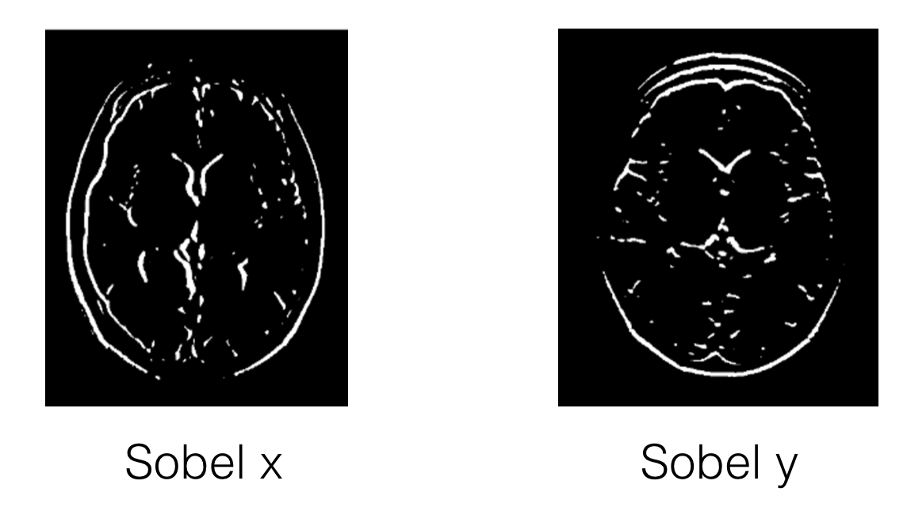

# Sobel Filters

Filters for edge detection and finding patterns in intensity.

Takes an **approximation of the derivative** of the image in the _x_ or _y_ direction.

* Derivative is a measurement of intensity change
  * Gradients in image measure change in intensity
  * For an image given by funciton F(x,y), gradient is the derivative operation F'(x,y)

Sobelx and Sobely:

* 
* x-direction emphasizes vertical edges
* y-direction emphasizes horizontal edges

## Magnitude

Detect which edges are strongest. Given by the magnitude (absolute value) of the gradient:

* abs_sobelx = sqrt((sobelx)2)
* abs_sobely = sqrt((sobely)2)
* abs_sobelxy = sqrt((sobelx)2+(sobely)2))

## Direction

Find edges in a particular direction i.e edges that only angle upwards or point left.

Direction of gradient = tan-1(sobely/sobelx)
