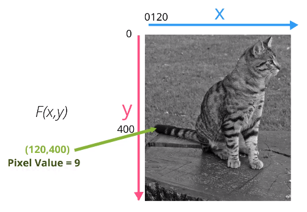
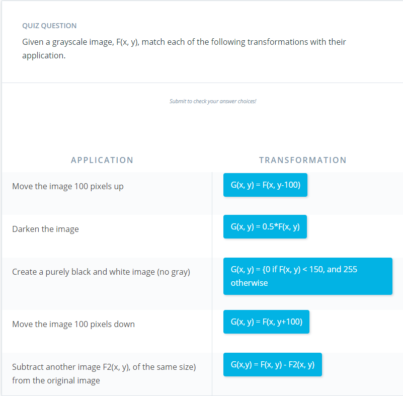

# Computer Image Representation

Images are 2D representations of 3D 'world scenes' containing:

* Color detail
* Shape detail
* Shading based on lighting conditions
* Size based on camera distance

## Images as Functions of Space

Images are made of a **grid of pixels** (matrix):

* Pixel = small unit of color or intensity
* Each index in the matrix corresponds to one pixel in the image

Each pixel has a corresponding numerical value:

* For grayscale images:
  * Range = 0-255
  * 0 = black
  * 255 = white

Each pixel also has a location, (x, y) in the image grid:

* Origin of grid is top left corner (0, 0)

F(x, y) = numerical value of the pixel at that location:

* 

Treating images as functions is the basis for many image processing techniques

## Image Processing using Functions

Processing techniques are methods for mathematically operating on an image pixel-by-pixel.

Processing = taking an image F(x, y) and outputting a **transformed image G(x, y)**

