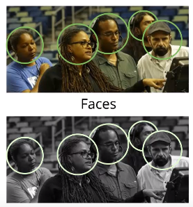
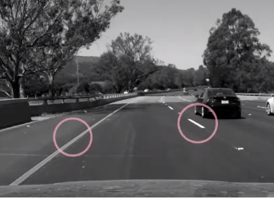
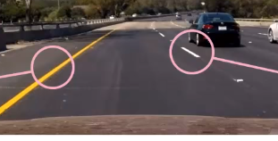

# Pre-Processing

Make images easy to analyse and process computationally

* Correct images and eliminate unwanted traits
  * Uneven lighting
  * Sharpening blurry images
* Enhance the most important parts of an image

Common pre-processing steps:

* Changing color schemes
  * Colour -> grayscale
* Changing spacial appearance
  * Geometric transform
* Change blurriness/sharpness
  * Filters

## Colour -> Grayscale

1.  Grayscale is generally more useful for object **recognition**
2.  Colour images contain extra information
    * Add extra complexity
    * Increase memory requirements

**Intensity**: Measure of lightness/darkness in an image

* Patterns in intensity define the shape and characteristics of mamy objects
* Grayscale images show the intensity

## Keeping Colour

Many applications require colour information from the images to be kept

* Grayscale images don't always provide sufficient information

Generally, if objects/traits are easier to identify given colour for humans, it's likely better to provide colour for computer vision algorithms too.

### Examples

Detecting different types of lane lines on a road:

* Which lane is yellow? Which lane is white?
  * 
  * Grayscale doesn't provide enough information
  * 

Computer-aided medical diagnostics:

* Colour can be a good indication of health/illness
  * i.e a red area of skin
