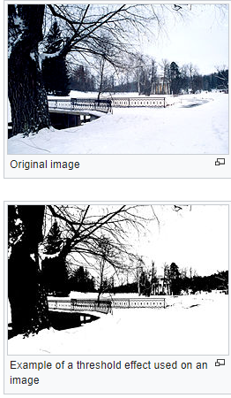
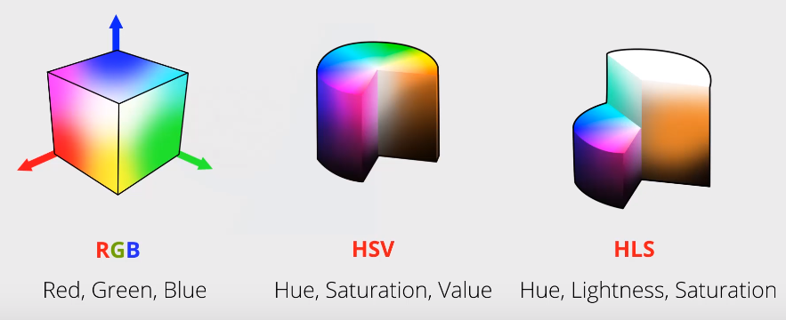
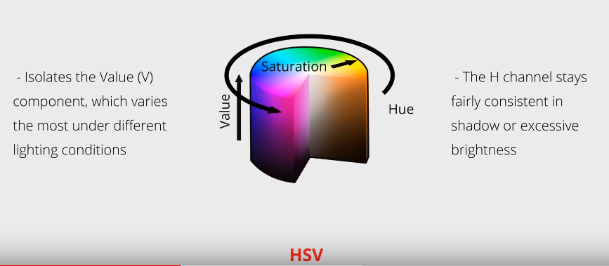

# Thresholding

Image Processing technique for **image segmentation** to partition an image into multiple segments that are easier to analyze.

Basic Definition for a Grayscale image:

* Given intensity for a pixel at location (i, j) _Ii,j_ and a fixed constant intensity value _T_
* For each pixel (i,j) in the image:
  * If _Ii,j_ < _T_:
    * Replace with a black pixel
  * Else if _Ii,j_ > _T_:
    * Replace with white pixel

* [source](<https://en.wikipedia.org/wiki/Thresholding_(image_processing)>)

## Color Thresholds

Designate a separate threshold for each of the RGB components of the image, then **combine them with an AND operation**.

## Color Spaces

RGB color selection depends on **even lighting and consistent color**:

* Easy to select the blue background:
  * 
* Simple blue colour threshold won't work:
  * 

HSV is more reliable for detecting coloured objects:

* 

See jupyter notebooks for examples
