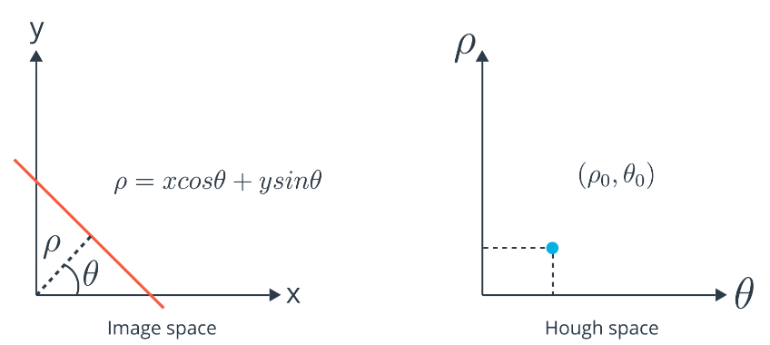
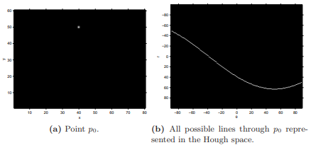
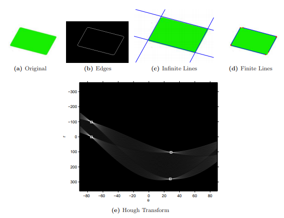

# Hough Transform

Method for finding continuous lines in an image. Edge detection (Canny, Sobel) produces an image described by it's pixels. Though 'lines' may be present and shown clearly, the lines themselves aren't defined.

Edges may also be discontinuous, not giving a complete line.

## Hough Space

Lines are represented in **Rho-Theta** form:

* &rho;=x&middot;cos&theta; + y&middot;sin&theta; &harr;
* y = -(cos&theta;/sin&theta;) &middot;x + &rho;/sin&theta;
  * &rho; = distance of line from the origin
  * &theta; = angle from the horizontal axis

Common form y=mx+b is not used because it cannot represent **Vertical lines**

* Has an infinite slope

Hough Space has two dimensions: &theta; and &rho;, where a **line is represented as a single point**

## Mapping Points to Hough Space

A single point in image space is mapped to **all possible lines** that can pass through that point.

## Detecting Lines

Each edge point is transformed to a line in Hough space. The areas where most Hough space lines **intersect** are interpreted as true lines in the edge map.

## Accumulator

2D-array:

* Rows = &rho; values
* Columns = &theta; values
* Size depends on desired accuracy:

  * &theta;: 1o angle accuracy = 180 columns
  * &rho;: 1 pixel accuracy -> number of rows = 2\*diagonal length of image

    * maximum distance is the diagonal length of the image

    * ranges from -maximum distance -> maximum distance, with step of 1

For each pixel (x,y) in a line, &rho; values are calculate for each value of &theta; 0,1,2...180 (to the desired degree of accuracy).

* Calculate values of &rho; for each &theta;, given the (x,y) values of a point
* Increment value in accumulator bin corresponding to each &rho;-&theta; pair
* Repeat for all points found by edge detection.

**Voting Process**

* Above procedure 'votes' on which lines are most likely
* The accumulator bins with the maximum votes will correspond to lines in the image
  * i.e. if the maximum 'voted' bin was at (50,90), the image will have a line at distance 50 from the origin and at angle 90o

## Algorithm

1.  Edge Detection (Canny/Sobel etc)
2.  Rho and Theta range creation
    * &rho; ranges from -max_dist to max_dist where max_dist is the diagonal length of the input image.
    * &theta; ranges from -90o to 90o
    * Resolution of ranges is a parameter to be chosen
3.  Accumulator Voting
4.  Peak Finding - Local maxima in the accumulator indicate parameters of most prominent lines in input image
    * Found most easily by applying a threshold

### Useful resources:

* http://opencv-python-tutroals.readthedocs.io/en/latest/py_tutorials/py_imgproc/py_houghlines/py_houghlines.html
* https://alyssaq.github.io/2014/understanding-hough-transform/
* https://en.wikipedia.org/wiki/Hough_transform
