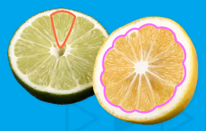
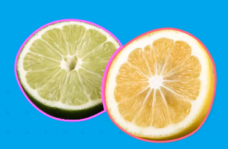
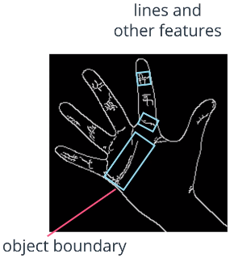

# Image Segmentation

Process of dividing an image into segments and unique areas of interest.

Two main methods:

1.  Connecting a series of detected edges
    * 
2.  Grouping into separate regions by area or distinct traits
    * 

## Image Contouring

Segments an image by its contours.

Contours = continuous curves that follow the edges along a boundary

* Provide a lot of informtation about the shape of an object boundary
* Detected best with binary images

Normal edge detection (i.e. Canny) will detect object boundaries as well as other lines and features:

Contouring will only detect the continuous edges along the object boundaries (not the extra lines)

**Contour Features**:

* Area
* Center
* Perimeter
* Bounding Rectangle
