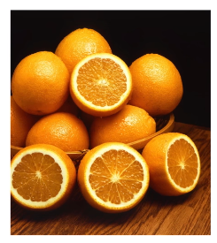
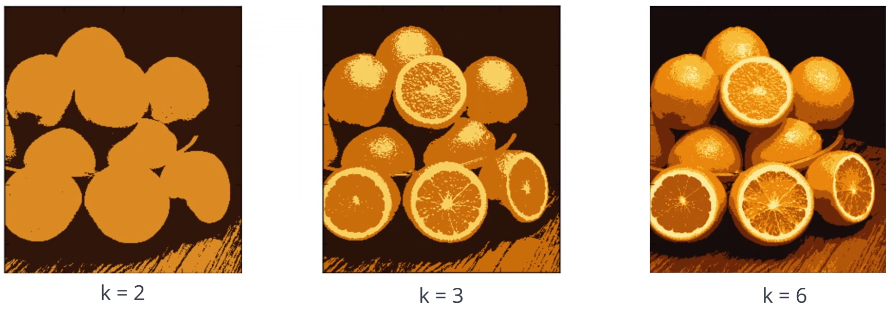
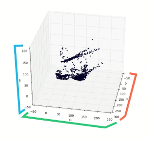
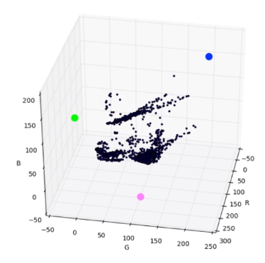
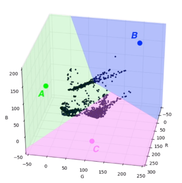

# K-Means Clustering

Separates an image into segments by clustering data points that have **similar traits**.

* **Unsupervised Learning** techinique

  * Machine learning algorithm that doesn't rely on labelled data
  * Aims to find groupings/patterns in unlabeled datasets

* _k_ = number of clusters to break image up in to
* 
* 

## Algorithm

Image is represented in RGB colour space

* 

1.  Choose _k_ random 'center' points
    * 
2.  Assign every data point to a cluster, based on it's nearest center point
    * 
3.  Update center points to equal the mean of all the values in it's cluster
    * Moves the center points towards the real center of the clusters
4.  Repeat until **convergence** is reached
    * Could be defined by a set number of iterations or a minimum distance moved by the center points after each iteration.
