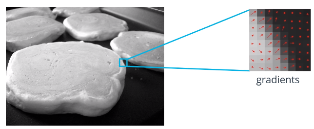
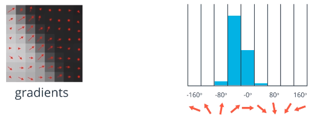
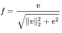

# Histogram of Oriented Gradients (HOG)

HOG is a **Feature Descriptor**:

* Simplified representation of an image
* Consists of extracted features
  * Discards extraneous information

HOG contains features of representing image gradients

* Describe shapes and patterns of intensity

Oriented gradients = direction of image gradients

HOG is a **feature vector**:

* Among images of the same object at different scales/orientations same HOG features can detect the object

1.  Calculates magnitude and direction of the gradients at **each pixel**
2.  Groups pixel into square cells
    * i.e. 8x8 pixels
    * 
3.  Calculate HOG of cells
    * Weighted voting of gradients in each cell falling within a certain range of orientations
    * Vote weight works well as magnitude of gradient
      * Could also be some function of the magnitude
    * Bins either in range 0-180 or 0-360
      * Unsigned gradient -> 0-180
      * Signed gradient -> 0-360
    * Unsigned gradient with histogram channels found to work best
    * 
4.  Block Normalization
    * Normalize the histograms in larger blocks
    * i.e. for 8x8 cells, normalize using 16x16 blocks (4 cells)
    * Make histograms more invariant to lighting conditions
    * Reduces dimensionality of data
    * L2-norm works well
      * Divide each element in the vector by the length of the vector
      * 
5.  Calculate HOG feature vector
    * Concatenate block normalized vectors

The HOG feature vector can then be used to train a **classifier**.

## Useful Resources

* https://en.wikipedia.org/wiki/Histogram_of_oriented_gradients
* https://www.learnopencv.com/histogram-of-oriented-gradients/
