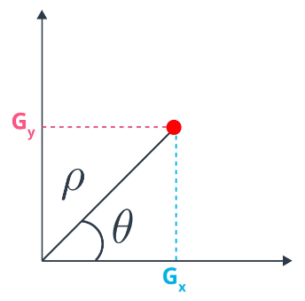

# Features in Computer Vision

**Feature** = a measurable piece of data in an image

* Distinct colour
* Line
* Edge
* Image segment

## Good Features

Should be easily compared and traked among images of the same object or scene

* Consistent across scales, lighting conditions and angles
* Can be identified in noisy images

Feature extraction **reduces dimensionality** of the image data:

* Isolate specific colour/spatial information
* Transform large sets of image data to smaller sets of features

## Feature Types

* Edges
  * Areas with a high intensity gradient
* Corners
  * Intersection of two edges
* Blobs
  * Region-based features -> areas of extreme intensity or unique texture

**Corners** match _exactly_ and are good features

* Represent a point where two edges change, moving the two edges will make the corner not match
  * Can determine exactly where the corner should be

### Example

Which area do the patches match with?

#### **A**

Blank white blob, could be anywhere within multiple sections of the image

* Doesn't have very good features

#### **B**

B contains an **edge**. It's orientation means it must be along the boundary between the bottom white section and the red section.

**However**, it could be _anywhere_ along that edge, so it's exact position cannot be determined

* Can only approximate

#### **C**

C contains a **corner**, can be matched **exactly** to the position in the bottom right

## Corner Detection

Corners have **large variation in intensity in all directions**

* Large gradient in all directions

**Sobel Operators/Filters** approximate the gradients of the image in _x_ and _y_ direction seperately:

Magnitude and direction from Sobel operators using **Polar Coordinates**:
(used in Hough Transform)

* Gx = Sobelx = gradient in _x_ direction
* Gy = Sobely = gradient in _y_ direction

After applying above:

Apply windowing to the image:

* Shift a window around an area in the image
* Check for a **large variation** in the directino and magnitude of the gradient
