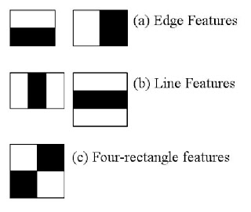

# Haar Cascades

Object detection method using Haar features-based cascade classifiers

Haar Features used in face detection:

* 

Uses a **cascade** of classifiers:

1.  Applies a Haar feature detector to the image
2.  Performs classification over the entire image
3.  If insufficient feature detection response, the area of the image is classified as not the desired object.
4.  This region is then **discarded**
5.  The reduced image is then fed into the next Haar feature detector
6.  Repeat through all desired Haar feature detectors, reducing the image each time.

Quickly removes irrelevant information from the image

* Makes algorithm **very fast**
