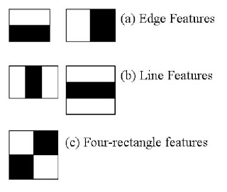
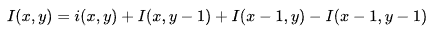

# Haar Features

Gradient measurements used to **categorize image subsections**:

* Considers adjacent rectangular regions at a specific location in a detection window
* Sums up pixel intensities in each region
* Calculates difference between sums

Detect:

* Edges
* Lines
* Rectangle Patterns

## Human Face Example

Region of the eyes is darker than the region of the cheeks

* -> Haar feature with two adjacent rectangles lying above the eye and cheek region

## Computation

**Advantage** of Haar features = can be computed quickly using **integral images/summed-area tables**

### Summed-area Table

Quickly and efficiently sum the values of a **rectangular subse** of a matrix.

Value at an point (x,y) in the summed-area table is the sum of all the pixels **above and to the left** of (x,y), inclusive:

* 
* i(x,y) is the value of the pixel at (x,y)

Summed-area table can be computed in a **single pass** over the image.

Value in the summed-area table at (x,y):

* 

**Once computed**, the sum of intensities over **any rectangulare area** requires **exactly four array references**:

* 
  * A=(x0, y0)
  * B=(x1, y0)
  * C=(x0, y1)
  * D=(x1, y1)
* Sum of i(x,y) over rectangle A,B,C,D:
  * 
