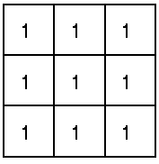
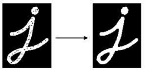

# Morphological Operations/Transformations

Image processing operations based on shapes. The operations rely on the relative ordering of pixel values, not on their numerical values.

* Suited well for binary images

Creates an output image of the same size as input image.

**Structuring element** is applied to an input image

* Small binary matrix
* Pattern of ones and zeroes specifies the _shape_ of the structuring element

The structuring element (kernel) is positioned at all possible pixel locations in the image and is compared to the corresponding neighbourhood of pixels.

* **fits** the image if for each of its pixels set to 1 the corresponding image pixel is also 1
* **hits**/intersects the image if for at least one of its pixels set to 1 the corresponding image pixel is also 1

* [source](https://www.cs.auckland.ac.nz/courses/compsci773s1c/lectures/ImageProcessing-html/topic4.htm)

Operations test whether the structuring element fits or hits the image.

## Dilation and Erosion

The two fundamental operations.

Pixel definitions:

* **Background** pixel = pixel in image set to 0
* **Foreground** pixel = pixel in image set to 1

### Dilation

Enlarges bright, white areas in an image by adding pixels to the perceived boundaries in the image.

Structuring element:

For each **background** pixel in the input image:

* If the structuring element **hits** (at least one pixel in the structuring element corresponds to a foreground pixel):
* Input pixel is set to the **foreground** value
* Else if all corresponding pixels in the image are background, the input pixel is left at background value.

Using the structuring element above, this sets any background pixel that has a neighbouring foreground pixel to the foreground value.

### Erosion

Shrinks bright, white areas in an image by removing pixels along object boundaries -> shrinking the size of objects.

Structuring element:

For each **foreground** pixel in the input image:

* If the structuring element **fits** (every pixel in the structuring element corresponds to a foreground pixel):
* Input pixel is left as it is.
* Else input pixel is set to background value

Using the structuring element above, this removes any foreground pixel that is not completely surrounded by other foreground pixels.

## Compound Operations

Combinations of fundamental erosion/dilation operations.

### Opening

Erosion followed by dilation - using the **same structuring element** for both operations.

Useful for **noise reduction**:

* Erosion first removes noise but also shrinks the object
* Dilation enlarges the object again, but noise will have been removed by previous erosion.

### Closing

Dilation followed by erosion - using the **same structuring element** for both operations.

Useful for removing (closing) small holes/black points inside foreground objects.

