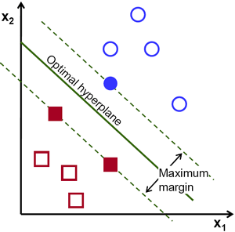
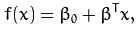
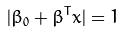
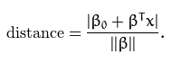
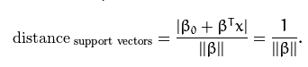
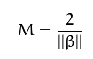
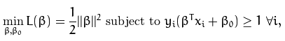

# Support Vector Machine (SVM)

Supervised learning model for classification and regression analysis.

Given a set of training examples, each belonging to a category, the SVM training algorithm will build a model that assigns new examples to a category.

Represents examples as **points in space**

* Mapped such that examples of separate categories are divied by a clear gap

SVM's compute an **optimal hyperplane** which separates training data

* Optimal hyperplane will give the **maxmimum margin**
  * **largest minimum distance** to the training examples
  * Too close to the points -> noise sensitive, not generalize corectly.

## Computing the Optimal Hyperplane

A hyperplane is defined as:

* &beta; = weight vector
* &beta;0 = bias
* _x_ = trainsing examples

Optimal hyperplane represented as the **canonical hyperplane**:

* _x_ = training examples _closest_ to the hyperplane
  * Called **support vectors**

Distance between a point _x_ and a hyperplane (&beta;,&beta;0):

For the canonical hyperplane:

Maximum margin _M_, twice distance to closest examples:

Maximizing _M_:

* xi = each of the training examples
* yi = each of the **labels** of the training examples
* **Lagrangian Optimization**
  * Solved using Lagran multipliers to obtain weight vector and bias of optimal hyperplane

## Resources:

* http://opencv-python-tutroals.readthedocs.io/en/latest/py_tutorials/py_ml/py_svm/py_svm_opencv/py_svm_opencv.html
* https://en.wikipedia.org/wiki/Support_vector_machine
