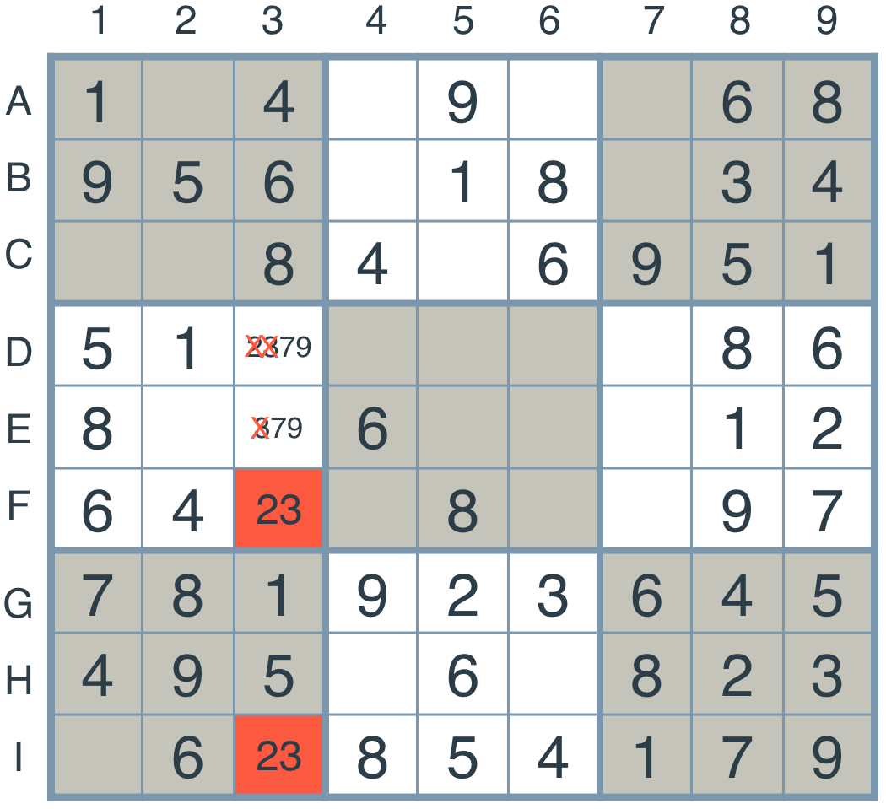

# Sudoku
* Rows = letters A,B,C,D...
* Columns = numbers 1,2,3,4...
* Boxes = Individual square at intersection or row and column -> A1, A2 etc
* Unit = Complete row, column or 3x3 square
    * Set of 9 boxes -> 27 units total
* Peers = For a particular *box* its peers are all other boxes belonging to a *common unit*
    * Each box has **20** peers


## Encoding the Board

### String representation:
* Values in boxes starting from top row to bottom
* '.' used for empty box
```
unsolved = '..3.2.6..9..3.5..1..18.64....81.29..7.......8..67.82....26.95..8..2.3..9..5.1.3..'
solved = '483921657967345821251876493548132976729564138136798245372689514814253769695417382'
```

### Dictionary representation:
* Keys = boxes
    * 'A1', 'I5' etc
* Values = digit in box or '.' if empty

### Representing Units and Peers
Example units:
```
row unit = ['A1','A2','A3'...'A9']
col unit = ['A1','B1','C1'...'I1'] 
box unit = ['A1','A2','A3',
            'B1','B2','B3',
            'C1','C2','C3']
```
* 3 possible row combinations for boxes -> 'ABC','DEF','GHI'
* 3 possible col combinations for boxes -> '123','456','789'
* box_units is cross product of above
```python
row_units = [cross(rows, d) for d in digits]
col_units = [cross(r, digits) for r in rows]
box_units = [cross(r_grp, c_grp) for r_grp in ('ABC', 'DEF', 'GHI')
             for c_grp in ('123', '456', '789')]
unit_list = row_units + col_units + box_units
```
Need a mapping of each square to list of *units* containing the square:
```python
units = {s:unit for s in squares for unit in unit_list if s in unit }
```
Need a mapping of each square to list of its *peers*
* Peers of a square, s = union of squares in units of s, excluding s itself
    * Get union of all units of s
    * Remove s from union
    * Add all units of s together
    * Create set from sum to remove duplicates
    * Remove s from set
```python
peers = {}
for s in squares:
    units_sum = []
    for u in units[s]:
        units_sum += u
    units_union = set(units_sum) - set(s)
    peers[s] = units_union
```
one-liner:
```python
peers = {s:set(sum(units[s],[]))-set(s) for s in squares}
```
### Encoding
* Input = string representation
* Output = dictionary representation

Create dict keys:
* Combine Row letters ('ABC'etc) and column digits ('123'etc) into 'A1' 'A2' etc.
    * Cross product of `[A...I]` and `[1...9]`
```Python
def cross(A, B):
    """ Cross product of elements in A and B
    """
    return [a+b for a in A for b in B]
digits = '123456789'
rows = 'ABCDEFGHI'
squares = cross(rows, digits)
```

Parse string input into dict of possible values for each square:
* Value in dict = value in input if present
* If a '.' in input (no value), dict value should be all possible digits
* `squares` (list of keys) will be in same order as input
* Create dict of square->input value:
    * `{'A1':'123456789','A2':'123456789','A3':'3'...}`
    ```Python
    def grid_values(grid_str):
        """Create dict of square:val from string representation of board
        """
        return {s: v if v!='.' else digits for s, v in zip(squares, grid_str)}

    ```
## Elimination Stategy
If a box has a value assigned, then **none of its peers** can have that value.

The red square can only be either **4 or 7** as these are the values not assigned to any of its peers:


Pass over every box in the grid and eliminate possible values from each based on its peers.

After one pass:


### Implementation
* Input a puzzle in dictionary form.
* Iterate over all the boxes in the puzzle that only have one value assigned to them -> 'starter' values in original puzzle
* Remove value from all of its peers
```python
def eliminate(values):
    solved = [b for b in boxes if len(values[b])==1]
    for b in solved:
        for p in peers[b]:
            values[p] = values[p].replace(values[b],'')
    return values     
```

## Only Choice Strategy
If there is only one box which would allow a certain digit, then that box **must** be assigned that digit.

There is only one box which contains *1*, therefore the *only choice* is to put the *1* in that box:


### Implementation
* For each unit in the grid:
    * Loop through possible values/digits (i.e '123456789')
        * initialise array `possible_boxes[]`
        * For each box in unit:
            * If current value/digit in values[box]
                * add box to `posible_boxes`
        * If possible_boxes has only 1 item:
            * set values[possible_boxes[0]] to current value/digit
```python
def only_choice(values):
    for unit in unitlist:
        for d in '123456789':
            possible_boxes = [b for b in unit if d in values[b]]
            if len(possible_boxes)== 1:
                values[possible_boxes[0]] = d
    return values
```

## Constraint Propagation - `reduce_puzzle()`
Apply constraint propagation to the sudoku by repeatedly applying the elimination strategy and only choice strategy. This uses the local constraints of each square to reduce the search space on each iteration. 

This **may not** solve the problem. Constraint propagation just **reduces search space** as much as possible. This *can* lead to a solution, but not necessarily 
* Must stop to avoid infinite loop when no more progress is made.

* Stop when puzzle is solved:
    * If number of solved boxes = 81
* Stop if no more progress is made:
    * Save number of solved boxes and compare
```python
def reduce_puzzle(values):
    stalled = False
    while not stalled:
        # Check how many boxes have a determined value
        solved_values_before = len([box for box in values.keys() if len(values[box]) == 1])

        values = eliminate(values)
        values = only_choice(values)
        # Check how many boxes have a determined value
        solved_values_after = len([box for box in values.keys() if len(values[box]) == 1])
        # If no new values were added, stop the loop.
        stalled = solved_values_before == solved_values_after
        # Sanity check, return False if there is a box with zero available values:
        if len([box for box in values.keys() if len(values[box]) == 0]):
            return False
    return values
```

This method doesn't work for harder puzzles:


After `reduce_puzzle`


## Search Strategy
* Pick a box with a minimal number of possible values.
* Try to solve each of the puzzles obtained by choosing each possible value, recursively
* A **Depth First Search**

### Implementation
* Create a tree of possibilities
* Traverse the tree using DFS until a solution is found for the puzzle

* Choose an unfilled square with fewest possibilities
* Recursively try to solve the resulting sudokus
    * If a value is returned (not False)
    * Return that result
```python
def search(values):
    values = reduce_puzzle(values)
    if values is False:
        return False # Failed in reduce_puzzle
    if all(len(values[s]) == 1 for s in boxes): 
        return values # Solved
    # Square (not already determined) with fewest possibilities 
    s = None
    for b in boxes:
        length = len(values[b])
        if length > 1:
            if s is None or length < len(values[s]):
                s = b
            
    for value in values[s]:
        new_grid = values.copy()
        new_grid[s] = value
        result = search(new_grid)
        if result: # returns False unless solved
            return result
```

## Naked Twins Strategy
If a pair of boxes in a given unit both have the **same 2** possible values, then
those values can be eliminated from the other boxes in the unit.




* Find pairs of squares which have 2 matching values
    * Narrow down to list of boxes which have 2 possible values
    * For each box w/2 possible values:
        * For each of its peers
            * If values of box and peer the same -> match
                * Use set() as values could be in any order i.e '12' should match '21'
                * If set(values[box]) == set(values[peer])
                * Add [box, peer] to `twins` list
    * Gives list of lists containing pairs -> `[['A1','A5'],['B1','C1']...]`
* For each pair remove their values from other squares in units containing both
    * Find intersection of peers of boxes in pair
    * For each peer in intersection:
        * If peer has more than 2 possible vals: -> Already determined otherwise
            * remove values of pair from peer
    