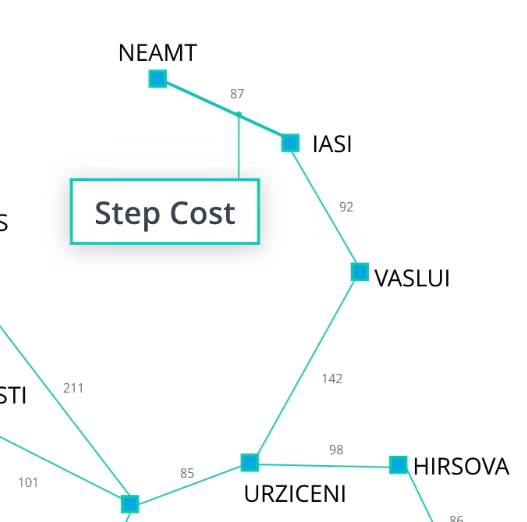
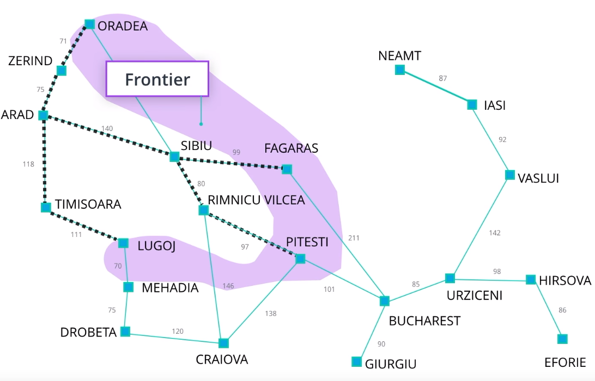
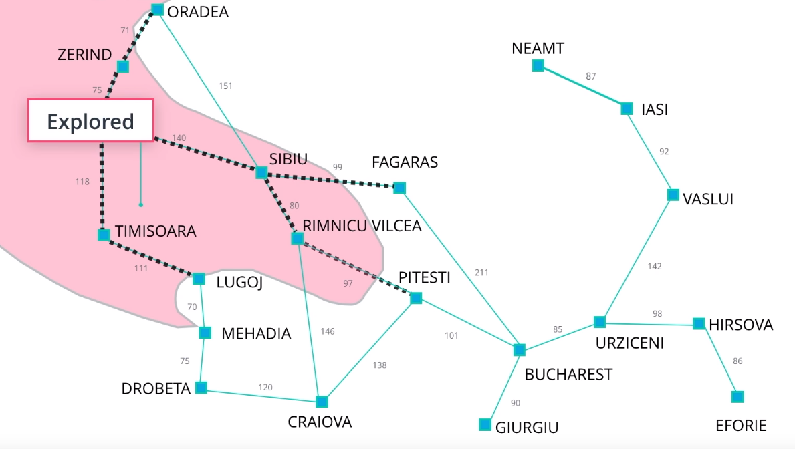
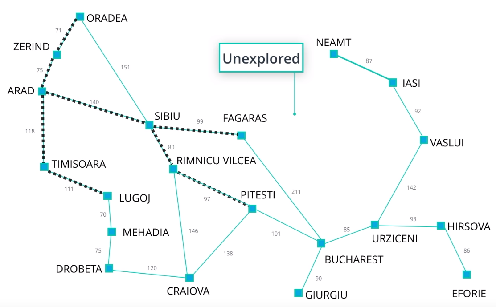

# What is a Problem
## Formal Definition
* Initial State -> S0
* Actions(s) -> {a1, a2,...}
    * State as input
    * Returns set of possible actions taht can be taken from the state
* Result(s,a) -> s'
    * State and action as input
    * Applies action to state and returns new state
* GoalTest(s) -> True|False
    * State as input
    * Returns whether the goal state has been reached
* Path Cost(si,si+1,si+2) -> cost value(n)
    * Sequence of state-action transtitions (path) as input
    * Returns cost of the path
    * Sum of step costs
* Step Cost(s, a, s') -> n
    * state, action, resulting state
    * returns cost of taking that action

## Mapping Definition to Problem Domain
* State Space = set of all states
    * Navigate state space by applying actions

    

* In each state, the space is partitioned into three components:
    * Frontier = Furthest nodes/states that have been explored

        

    * Explored State = Nodes that have been searched
        
        

    * Unexplored State = Nodes yet to be searched

        

