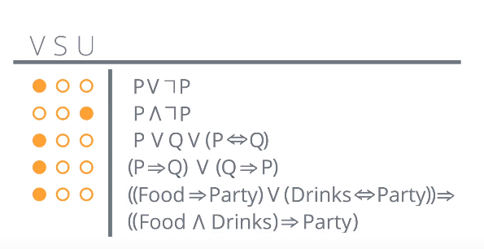
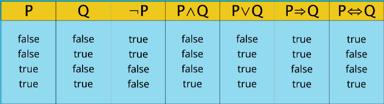

# Propositional Logic
Analyzing individually or in composition statements to which truth values (true, false) can be assigned.

* proposition = collection of declarative statements with either true or false value, or unkown
* propositional = propositional variables **and connectives**

* Connectives:
    * OR = &or;
    * AND = &and;
    * Negation/Not = ¬
    * Implication (if-then) = &rarr;
    * If and only if (IFF) = &harr;

* Propositional sentece is evaluated using a **model** of the world:
    * set of true/false values for propositions in the world
    * define truth of a sentence using values for propositions in model

## Sentence Types:
* Valid = true in every possible model
    * Every combination of values for the propositions
* Satisfiable = true in some models, but not all
* Unsatisfiable = False in every possible model

## Alarm Example:
* B = burglary occurs
* E = earthquake occurs
* A = alarm goes off
* M = Mary calling
* J = John calling

* Alarm is true whenever burglary or earthquake is true:
    * (E &or; B) → A
* Both John and Mary call, when alarm is True:
    * A &rarr; (J &and; M)
* John calls IFF mary calls:
    * J &harr; M
        * Equivalent -> J=True, M=True
* John call IFF mary doesnt call:
    * J &harr; ¬M

## Truth Tables
* List all the possibilities of the propositions
* For each possibilities, lists values for the sentence

## Limitations
* Cannot handle **uncertainty**
    * Can only reason with True/False certainties
* Cannot talk about objects that have properties and relations between them
* No shortcuts to distinctly 'talk' about many things happening at once
    * In the 'vacuum-cleaner world', to say 'No dirt in any location' would mean a conjunction of many many propositions