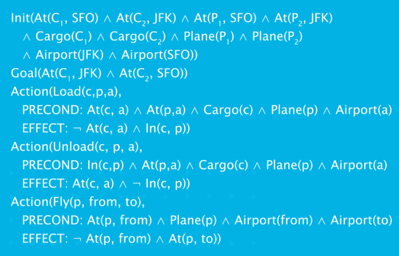
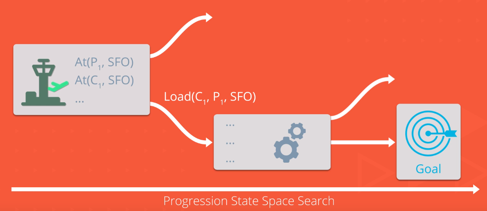
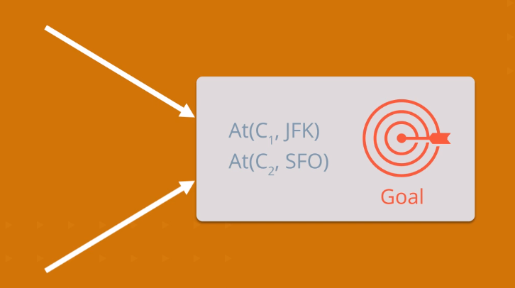
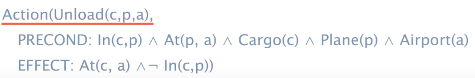
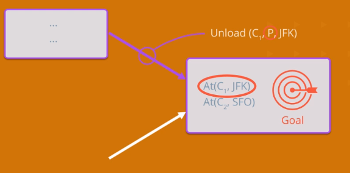
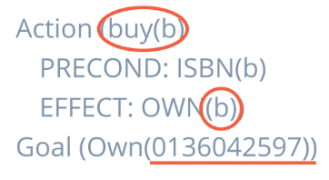
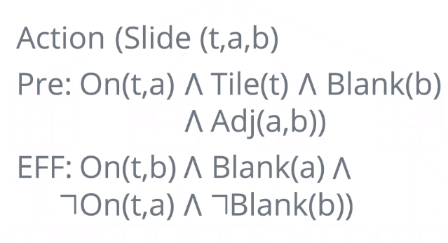
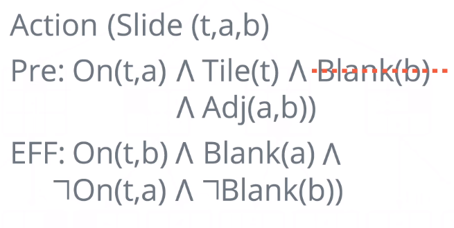
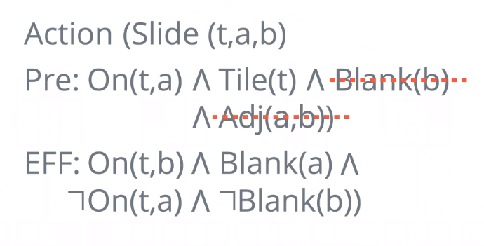
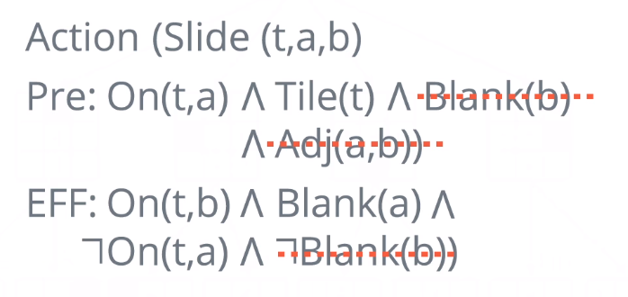

# Classical Planning
Representation language and approach for dealing with complexity in problem solving.
* Factors the world into variables

* State Space: possible assignments to *k*-Boolean variables
    * 2*k* states
* World State: Complete assignment to each variable
* Belief State:
    * Complete assignment
        * Deterministic, fully observable
    * Partial assignment
    * Arbitrary Formula in boolean logic
        * Can represent anything
* Use **Planning Domain Definition Language** to describe problems

## Action Schema
Represents many possible actions that are similar

Consists of:
* Action name and paramater list
* Precondition
    * Conjunction of funciton-free positive literals stating what must be true in a state before the action can be executed
    * All variables in precondition must also be in parameter list
* Effect
    * Conjunction of function-free literals describing how **state changes** when action is executed
    * All variables in effect must also be in parameter list

Example: Plane flying from airport *x* to airport *y*:
* Action(Fly(p,x,y))
    * PRECOND: Plane(p) &and; Airport(x) &and;Airport(y) &and; At(p,x)
    * EFFECT: ¬At(p,x) &and; At(p,y))

## Complete Problem Solving Domain Representation
Transporting cargo by plane:

Sufficient to represent **many** planes and items of cargo.

## Planning

### Progression Search
* Initial state = initial state from planning problem
* Actions for a state = actions whose preconditions are satisfied
    * Sucessor state is generated by adding the positive effect literals and deleting negative effect literals
    * Single successor function works for **all** planning problems as explicit action representation is used (action schema)
* Goal test
* Step cost of each action
    * usually 1

### Regression Search
Start at goal state and work backwards
* What action would lead to the goal state?
    * What are the states from which applying the action leads to the goal?
* Initial state = goal state

Example: Cargo Planes
* Cargo 1 must be at JFK and Cargo 2 must be at SFO

* Only one action schema with an **At()**:

* Now know that the previous action must be an Unload(C1,P,JFK)
    * Need any plane
    * Need Cargo C1
    * Need airport JFK
    

* Now know **some** of the variables in the previous state
* Continue regressing until a state with enough variables determined is found

### Regression vs Progression
* Regression can reduce branching factor of states
* Example: Buying a book with a given ISBN
    * 
    * Progression would require branching out to all possible ISBN numbers until the desired one is generated
    * Regression will start with the correct ISBN, reducing branching greatly
* However Forward seach can use **good heuristics** to produce a result efficiently
    * Dealing with **concrete plan states** (no partial states) means it is easier to develop heuristics

## Heuristics
Encoded problem and action definitions mean heuristics can be generated programatically
* By **relaxing** the problem

* Example: 22 Sliding blocks puzzle

* **Ignore Preconditions** heuristic: Relax the problem by automatically **removing a prerequisite**
    * Manhattan distance heuristic:
    * 

    * Number of misplaced tiles heuristics:
    * 
* Relax problem by **ignoring negative effects**
    * 
* Programatically use relaxation techniques to produce a good heuristic