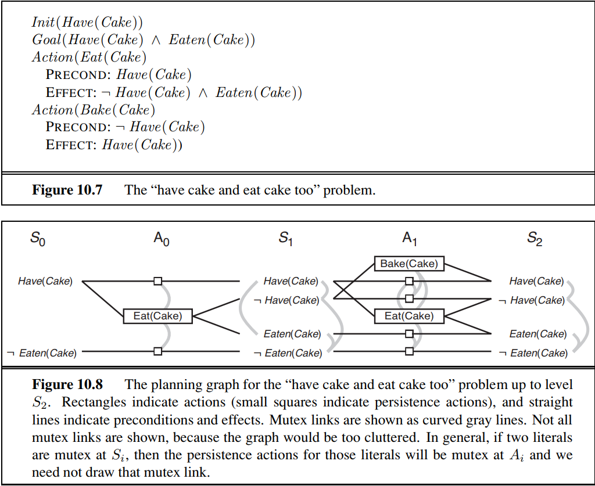

# Planning Graphs
* Polynomial size approximation of the full state->action->successor state tree
    * Planning problem with *l* literals and *a* actions:
        * Each *Si* has no more than *l* nodes and *l2* mutex links
        * Each *Ai* has no more than *a+l* nodes, *(a+l)2* mutex links and *2(al+l)* precondition and effect links
        * Entire graph with *n* levels = ***O(n(a+l)2)*** size and time to build complexity
* Use to *estimate* number of steps required to reach goal *G* from initial state *S0*
    * Always **correct** when reports the goal is **not reachable**
    * **Never overestimates** number of steps
        * **Admissable heuristic**
* Directed graph organized into **levels**
    * Alternating State , *Si* and Action , *Ai* levels
    * Every *Si* contains:
        * All the literals that could result from any possible choice of actions in *Ai-1*
        * Constraints saying which pairs of literals are **not possible**
    * Every *Ai* contains:
        * All the actions that are applicable in *Si*
        * Constraints saying that two actions cannot both be executed at the same level
    * Level *S0* consists of nodes representing **each fluent** that holds in *S0*
    * Level *A0* consists of nodes for each ground actions that might be applicable in *S0*
    * Continue alternating *Si*, *Ai* until termination condidtion is met
* Graph **levels off** when two consecutive levels are identical

* **Persistence Action**
    * A literal can persist of if no action negates it
    * For every literal *C*, a persistence action is added with precondition *C* and effect *C*
* **Mutual Exclusion/Mutex Links**
    * Indicate literals that cannot appear together, regardless of the choice of actions
    * Mutex relation holds between two *actions* if any of conditions hold:
        * Inconsistent effects
            * One action negates an effect of the other
        * Interference
            * One of the effects of an action is the negation of a precondition of the other
        * Competing needs
            * One of the preconditions of an action is mutually exclusive with a precondition of the other
    * Mutex relation holds between two *literals* at the same level if:
        * Inconsistent Support
            * One is the negation of the other
            * Or if each possible pair of actions that could achieve the tow literals is mutually exclusive

## Heuristic Estimation
* If any goal literal does not appear in the final level of the graph -> problem is **unsolvable**
* **Level cost** of goal literal*gi*
    * Estimate total cost of achieving any *gi* from state *s*
    * The level at which *gi* first appears in the planning graph constructed from inital state *s*
* **Serial planning graph**
    * Insists that only one action can actually occur at any given time step
        * Add mutex links between every pair of *nonpersistence* actions
    * More accurate **level cost** as the number of actions is implicitly taken into account (one per level), whereas with a normal planning graph only the number of levels is taken into account (multiple actions per level)
### Conjunctive Goals
* **Max level heuristic** 
    * Takes maximum level cost of any of the goals
    * Admissable
    * **Not necessarily accurate**
* **Level sum heuristic**
    * Sum of level costs of the goals
    * Can be inadmissable
        * Works well with problems that are largely decomposable
* **Set Level heuristic**
    * Finds the level at which all literals in the conjunctive goal appear in the planning graph **without anypair being mutex**
    * Admissable
    * More accurate than max-level
    
