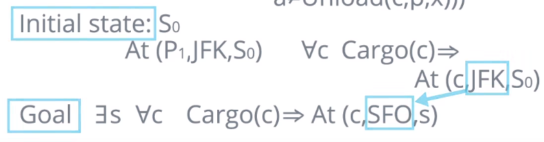

# Situation Calculus
When a goal includes the notion of **All**
* i.e. move all cargo from airport a to airport b
* Uses First Order Logic

* Full power of first order logic
    * Doesn't need special solvers, can use existing First ORder Logic solvers
* Can represent any complex scenarios without massive state spaces
* Flexible

* Actions: objects
    * Fly(p, x, y)
* Situations: objects
    * Paths of actions
    * Arriving at same state by two different actions gives two different situations
    * S0 S'=Result(s,a)
    * Actions that are possible in a state represented by a predicate - **possiblity axiom**
        * Poss(a,s)
        * SomePrecond(s) => Poss(a,s)
        * Possiblity axiom for action Fly(p,x,y) =  Plan(p,s) &and; Airport(x,s) &and; Airport(y,s) &and; at(p,x,s) &rarr; Poss((Fly(p,x,y),s)

## Successor-State Axioms
* **Fluents=** = Predicates that can vary from one situation to another
    * Refer to a specific situation 
        * last paramater in the predicate
    * At(p,x,s)
* Use **Successor-State Axioms** to describe what changes in a state for each fluent
    * &forall;a,s Poss(a,s) &rarr;(fluent true &harr; a made it true &or; a didn't undo)
        * Either fluent wasnt true before, but a made it true, or it wasa true before and a didn't make it false
* Example: Cargo planes, In(c,p,s) c = cargo, p = plane, s = situation
    * Poss(a,s) &rarr; In(c,p,result(s,a)) &harr; (a=Load(c,p,x)&or;(In(c,p,s)&and; a!=Unload(c,p,x)))
        * For all a,s for which its possible to execute a in situation s. The In() predicate holds IFF the action was a load or the In() predicate held in previous stae and action a was not an unload action
## Initial and Goal States
Can be very flexible/broad in description of goal states
* using for all/ exists

