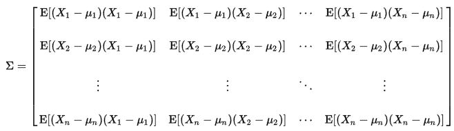

# Probability Distributions

**Probability Density Function**:
* Probability that random variable X falls into an interval around *x* divided by the width of the interval, as the interval width goes to zero
* P(x)=limdx&rarr;0P(x<=X<=x+dx)/dx
* Must be nonnegative for all *x*
* Must have &int;-&infin;&infin;P(x)dx=1

**Cumulative Probability Density Function**:
* Probability of a random variable being less than x
* FX(x)=P(X<=x)=&int;-&infin;xP(u)du

**Gaussian/Normal Distribution**
* P(x) = (1/&sigma;&middot;sqrt(2&pi;))&middot;*e*-(x-&mu;)2/(2&sigma;2)
    * &mu; = mean
    * &sigma; = standard deviation
    * x = continous variable -&infin;<=x<=&infin;
* Standard Normal Distribution:
    * Normal distribution with &mu;=0 and variance &sigma;2=1

**Multivariate Gaussian Distribution**:
* Distribution over a vector **x** in *n* dimensions
* P(**x**) = (1/sqrt((2&pi;)n|**&Sigma;**|))&middot;*e*-1/2((**x**-**&mu;**)T**&Sigma;**-1(**x**-**&mu;**))
* **&mu;** = mean vector
* **&Sigma;** = covariance matrix

**Central Limit Theorem**:
* The distribution formed by sampling *n* independent random variables and taking their means tends to a normal distribution as *n* tends to infinity.

**Expectation**:
* Mean or average value for a random variable, weighted by the probability of each value
* Discrete variable: 
    * E(X) = &sum;ixiP(X=xi)
* Continuous variable:
    * E(X) = &int;-&infin;&infin; xP(x)dx
    * Integral over probability density function P(x)

**Root Mean Square**:
* RMS of a set of values = square root of the mean of the squares of the values
* RMS(x1,...,xn)=sqrt((x12,...,xn2)/n)

**Covariance**:
* Between two random variables = Expectation of the product of their differences from their means
* cov(X,Y)=E((X-&mu;x)(Y-&mu;y))

**Covariance Matrix**:
* Matrix of covariances between elements of a vector of random variables
* **&Sigma;**ij=cov(Xi,Xj)=E((Xi-&mu;i)Xj-&mu;j)
* **X** = <X1,...,Xn>T
* 