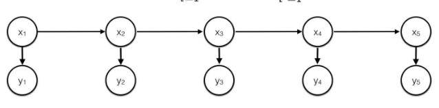
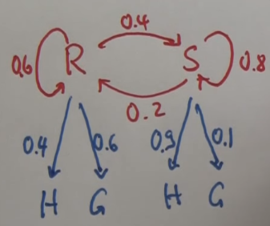

# Hidden Markov Model Basics
Markov Model in which the **states are not observed**

Measurement variables (observations/evidence) are observed, from which **state can be inferred**

## Basic Inference
For HMM with parameters:
* Next state distribution
* Observation/measurement distribution
* Initial state distribution

Probability of a state Xi, given an observation Zi:
* P(Xi|Zi) = P(Zi|Xi)&middot;P(Xi) / P(Zi)
* Or with a normalizer: &alpha;P(Zi|Xi)&middot;P(Xi) 

Predict distribution of a state Xi+1, given knowledge of Xi:
* P(Xi+1)=&sum;xiP(Xi)&middot;P(Xi+1|Xi)