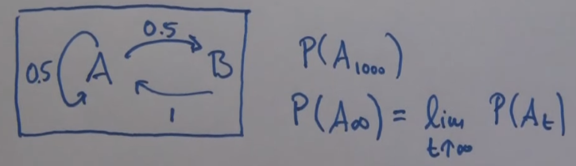
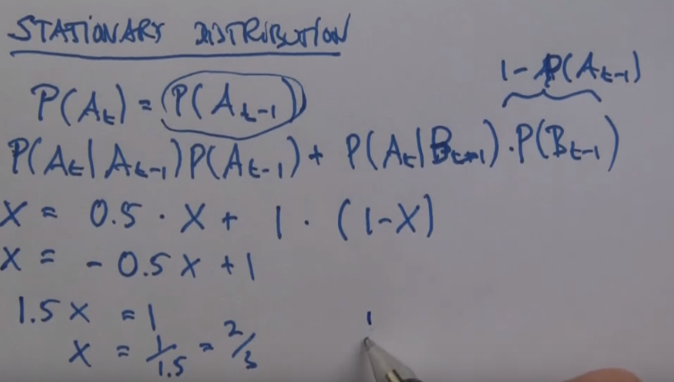

# Markov Chain
Model in which each state **only depends on its predecessor**
* The Markov Property = Conditional probability distribution of future states of the process depends **only** upon the present state.
    * Memoryless property of a stochastic process
## Formal Definition
**Markov model** = stochastic model used to model randomly changing systems
* Finite state machine which changes state once every time unit and each time *t* that a state *j* is entered a possible observation vector **o**t is generated from the probability density bj(**o**t)
* Transition from state *i* to *j* is probabilistic
    * Governed by a discrete probability distribution *a*ij
* Future states depend **only on the current state**
    * The **Markov property**
* Enables reasoning and computation in models which are often intractable when considering a history of state
* Joint probability of an observation sequence **O** being generated by the model *M* moving through state sequence *X* is the product of the transition and output probabilities:
    * P(*O*, X|M) = a12b2(**o**1)a22b2(**o**2)a23b3(**o**3)

## Stationary Distribution
Probability distribution of a Markov chain that **remains unchanged** as time progresses.

Given by finding the probability of a state at time=&inf;

## Calculating Transition Probabilities

### Maximum Likelihood
Use a set of observations to find the transition probabilities for the model.
using **maximum likelihood**
* Proportion of times in the observation sequence that a transition has occurred

Can lead to **overfitting**

#### Example
**O** = S,S,S,S,S,R,S,S,S,R,R
* 8 total transitions from S
    * 6*S->S
    * 2*S->R
* 2 total transitions from R
    * 1*R->S
    * 1*R->R
* P(R0)=0
    * Only one t=0 observation and it was S not R
* P(S|S) = 6/8 = 3/4
* P(R|S) = 2/8 = 1/4
* P(S|R) = 1/2
* P(R|R) = 1/2

### Laplace/Additive Smoothing
Method to avoid overfitting of maximum likelihood

Uses a **pseudocount** to to change the expected probability in a model of data
* Added to the tnumebr of observed cases
* Simplest approach is to set to **1**
    * Can be adjusted if appropriate prior knowledge is present

#### Formal definition:
Given:
* An observation **x**=(x1...xd)

* From a multinomial distribution:
    * *N* trials
    * Parameter vector &theta;=(&theta;1...&theta;d)

A smoothed version of data gives the estimator:
* &theta;*i= xi+k / N + k&middot;d
* *i* = 1,...,d
* k = **pseudocount**
    * k > 0
    * Smoothing parameter

#### Example
With **k=1**

**O** = S,S,S,S,S,R,S,S,S,R,R
* 8 total transitions from S
    * 6*S->S
    * 2*S->R
* 2 total transitions from R
    * 1*R->S
    * 1*R->R
* Can be either R or S -> d=2
* k&middot;d = 1*2 = 2
* P(R0)= 1+1/1+2 = 2/3
* P(S|S) = 6+1/8+2 = 7/10
* P(R|S) = 2+1/8+2 = 3/10
* P(S|R) = 1+1/2+2 = 2/4 = 1/2
* P(R|R) = 1+1/2+2 = 2/4 = 1/2