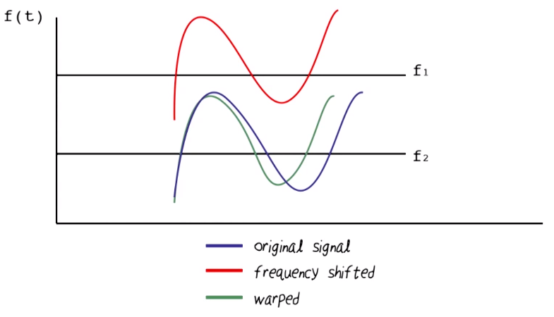
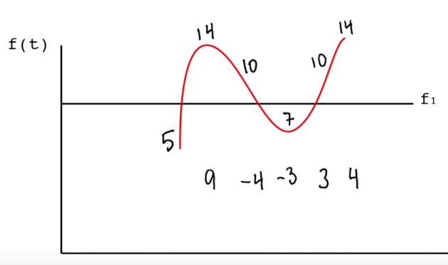
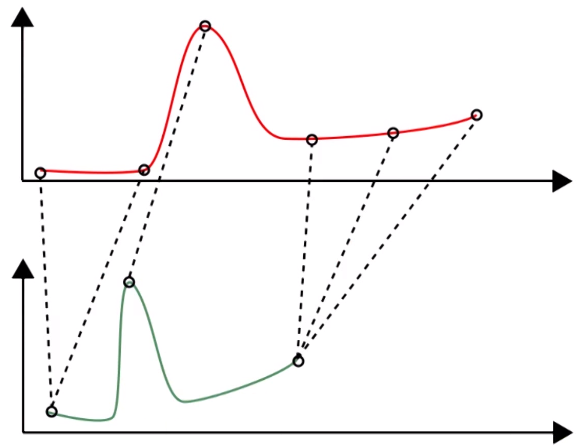
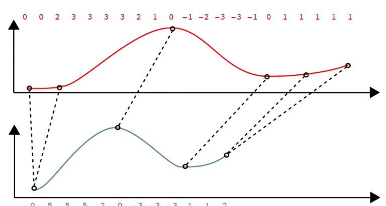
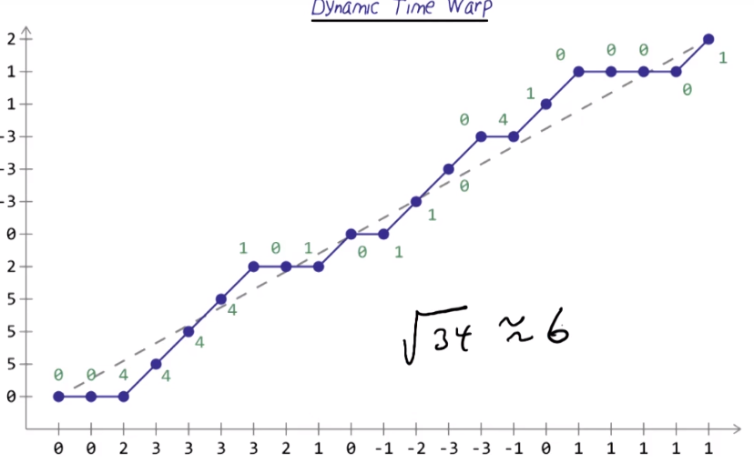
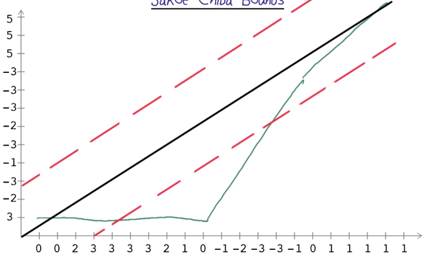
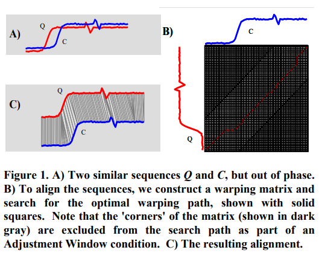

# Pattern Recognition Through Time
Extract and recognize patterns in time series data

## Example: Recognize classes of dolphin whistles

### Varying Frequencies 

Frequencies can vary, but the **pattern** stays the same:
* Raise or lower frequency of whistle

Solution: Use **change in frequency**, &Delta;F to define **patterns**:

### Time Warping
Same pattern can be present over different time intervals:
* i.e. saying 'Hello' or 'Helloooooooo'

Need to recognise **features** whether they are drawn out or produced quickly:

#### Euclidean Distance
Make samples same length:
* Pad shorter with 0s

Calculate euclidean distance between all the points:

= Sqrt(170) = approx. **13**

**Insufficient**: very sensitive to distortion in the time axis

#### Dynamic Time Warping
Calculates an **optimal match** between two time series with certain restrictions

[Ratanamahatana and Keogh’s “Everything you know about Dynamic Time Warping is Wrong”](http://wearables.cc.gatech.edu/paper_of_week/DTW_myths.pdf)

Sequences are non-linearly **warped** in the time dimenstion to determine a measure of their **similarity** independent of certain non-linear variations in time dimension.

Allows two time series that are similar but **locally out of phase to align in a non-linear manner**.
* Align the samples to where they 'best' match up

Much better than Euclidean:

##### Sakoe Chiba Bounds
DTW can make signals which are very **different** seem more similar than they are.

Sakoe Chiba bounds place upper and lower bounds on the 'best match' values between the two:

Bounds can be calculated **empirically**, set different bounds and use cross-validation to make sure they are reasonable

#### DTW Algorithm
Given two time series, length *n* and *m*:
* Q=q1,q2...qn
* C=c1,c2...qm

Construct an *n*-by-*m* matrix where (ith, jth) element corresponds to the **squared distance d(qi,ci)=(qi-ci)2**
* Alignment between points qi and ci

Retrieve a path through the matrix that **minimizes the total cumulative distance between them**

Optimal path that **minimizes warping cost**:
* DTW(Q,C)=min(sqrt(&sumkKwk))
* wk = matrix element (i,j)k that also belongs to kth element of a warping path W - a contiguous set of matrix elements that represent a mapping between Q and C

Use **dynamic programming** to find warping path by evaluating the recurrence:
* &gamma;(i,j) = d(qi,ci) + min(&gamma;(i-1,j-1), &gamma;(i-1,j), &gamma;(i,j-1))
    * d(i,j) = distance found in the current cell
    * &gamma;(i,j) = cumulative distance of d(i,j) and the minimum cumulative distances from the three adjacent cells

