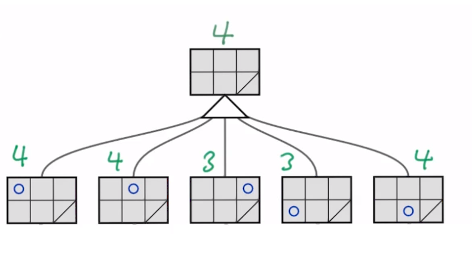
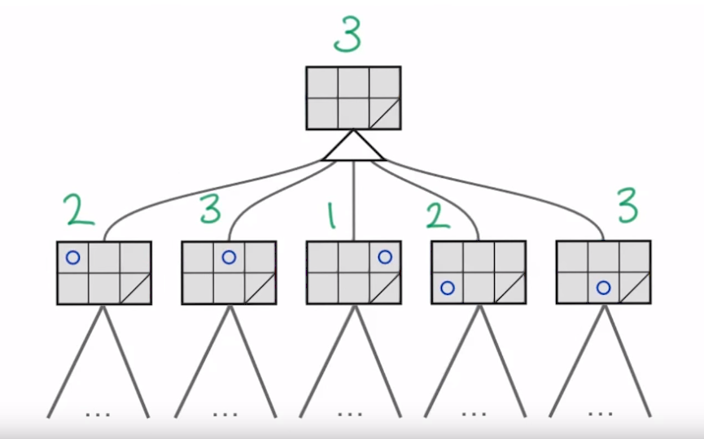
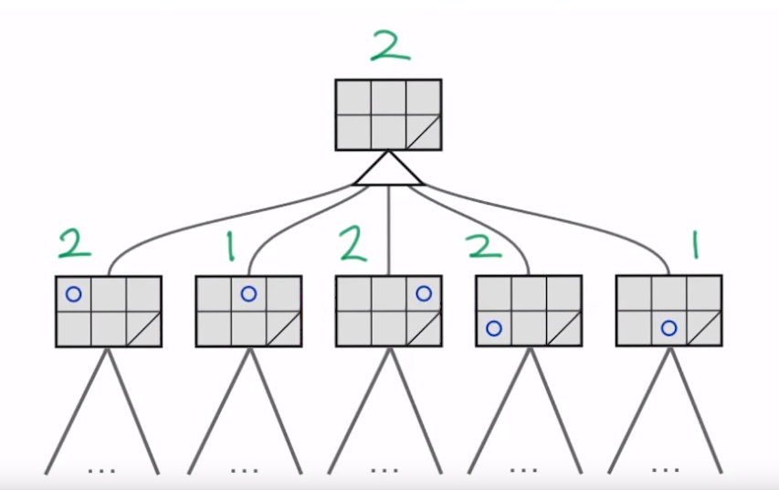
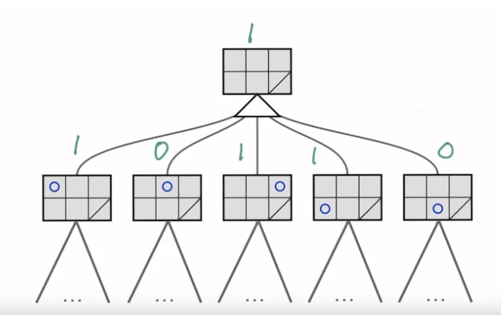
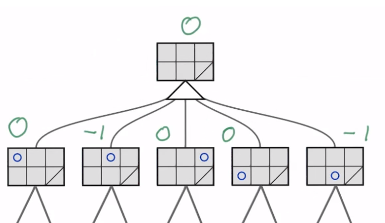
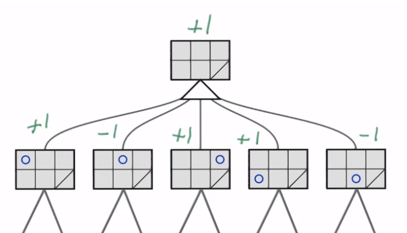

# Evaluating The Game Tree
Branching factor = number of children at each node
* Number of possible moves in each game state

For 5x5 Isolation, branching factor &asymp; 8, giving a max numebr of nodes:
* 8<sup>25</sup> = 10<sup>22</sup>

Assuming a computer can do 10<sup>9</sup> operations per second, that would take 1.2 million years to fully evaluate.

## Depth Limited Search
Limiting the depth that a depth first search is allowed to reach, in order to safely meet a deadline/time limit.

Calculate the maximum depth using a **time limit** for the search i.e. 2 seconds.

Assuming PC does 10<sup>9</sup> operations per second.

Time limit = 2 seconds

Maximum number of nodes that can be searched within time limit:
```
10^9 nodes x 2 sec = 2x10^9 nodes
```
Maximum number of levels:
log law -> log<sub>a</sub>x = log<sub>b</sub>x / log<sub>b</sub>a
```
x = number of levels
8^x < 2x10^9
log8(8^x) < log8(2x10^9)
x < log10(2x10^9) / log10(8)
x < 10.3
```
As branching factor of 8 is approximate, use a value for x less than the calculate value, safely use x=9.

## Quiescent Search
Limiting the depth of search means the **horizon effect** can be a problem. 
* Move that seems optimal using limited depth turns out to be detrimental further down the tree, in a section that is not searched.

Search the tree repeatedly using deeper levels of search and compare the recommended branches. When the recommended branches begin to stay consistent between depths, a state of quiescence is present and the depth is likely to be safe in order to avoid the horizon effect.

### Level 1
Best moves = Two center moves and top left


### Level 2
Best moves = Two center moves


### Level 3
Best moves = Corner moves


### Level 4
Best moves = Corner moves


### Level 5
Best moves = Corner moves


### Level 6
Best moves = Corner moves


After level 3 a state of quiescence has been found and the recommended branches are not changing much.