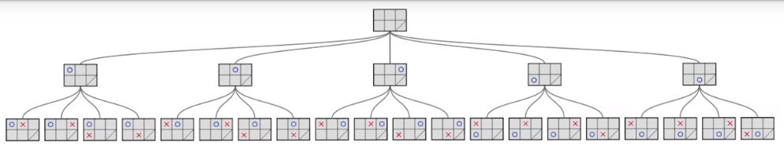

# Representing a Game
Most common games in AI have properties:
* Deterministic
* Fully Observable
* Adversarial

In game theory this is known as deterministic, turn taking, two player, zero-sum games of perfect information.
* Zero-sum = the total payoff to all players is the same for every instance of the game. The loss/gain of utility of a player is balanced by the loss/gain of utility of other players. i.e. **Chess**

## Definition
A game is a **search problem** as follows:
* S0: **Initial State**
* Player(s): Player with initiative in a state
* Actions(s): Functino returns set of legal moves in a state
* Result(s,a): Function returns a Transition model - result of a move
* Terminal-Test(s): True when the game is over and false otherwise
    * A game state is a **terminal state** if the game is over
* Utility(s,p) or Evaluation(s,p): Funcition defines the final numeric value for a games terminal state *s* for player *p*.

## Game Tree
Representation of all the possible states and their outcomes for a game.
* nodes = game states
* edges = moves

The **initial state, actions function and result function** define the game tree:
* At level 0, a single node representing the initial state of the game is present.
* At level 1, the nodes are all the possible first moves for player 1 from the initial state.
* At level 2, the nodes are all the possible moves of player 2 for each of the board created at level 1 by the possible moves of player 1
* This process repeats, alternating between player 1 moves and player 2 moves until the game is complete

The first 3 levels of a 3x2 isolation game:

### Total Nodes Formula
* *b* = branching factor
* *d* = depth
* *n* = total number of nodes

* *n = bd+1 - 1 / b-1