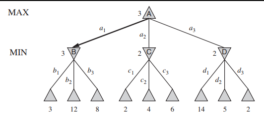
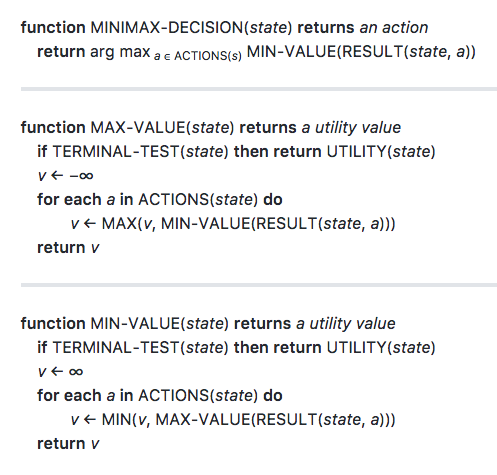

# MiniMax Algorithm
Finds the optimal moves in an **adversarial search** game tree. The players of the game are MAX and MIN. These alternate turns in the game tree, with MAX at the root (player computer is trying to win for).

Assumes **both** players play optimally.

Optimal strategy is determined from the **minimax value** of each node in the tree. 
* Utility for MAX of being in the nodes corresponding state 
* MAX will move to a state of maximum value
* MIN will move to a state of minimum value
    * MIN is actively trying to **reduce** MAX's utility

For:
* a &isin; Actions(s)
* s = game state
```
MINIMAX(S) = 
if TERMINAL-TEST(s):
    return Utility(s)

if Player(s) = MAX:
    return max(MINIMAX(Result(s,a)))

if Player(s) = MIN:
    return min(Minimax(Result(s, a))) 
```



* The minimax algorithm computes minimax values from the leaves of tree up. 
* Recursion proceeeds down to the leaf nodes where utility of nodes is the value returned by the utility function. 
* Then the minimax values are **backed up** through the tree as recursion 'unwinds'.

For the tree above:
* Algorithim recurses to the three bottom left nodes
* Utility function for these nodes return 3, 12 and 8
* Since the parent of these three nodes (B) is MIN, the minimum value 3 is backed up as the minimax value for node B
* This is repeated for the other two sets of leaf nodes, giving minimax values for B, C and D as 3, 2 and 2 
* Since the root node is MAX the maximum minimax minmax value of its children B, C and D is backed up giving the root a minimax value of 3.


* Complete **depth-first** search of the game tree.
* Given max depth *m* and *b* legal moves at each point:
    * time complexity = O(b<sup>m</sup>)
    * space complexity = O(bm) if actions generated at once
                        or O(m) if actions generate one at a time

## Pseudocode


Calculates minimax decisions. Returns the action corresponding to the **best possible** move - best utility.
* Max-Value and Min-Value functions go through **whole game tree**, determining the backed up value of a state.
* argmax<sub>a&isin;S</sub>f(a) = function computes element *a* of set *S* that has maximum value of f(a)
