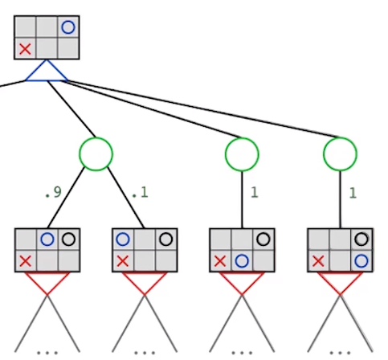

# Expectimax / Probabilitic Search
* Variation of Minimax for games with **chance elements**
    * Don't know the result of an action
* **Chance** Nodes = outcome is uncertain
* Calculate **expected utilities**
    * Weighted average (expectation) of values of children



The **expected value** of node *i*:
```
value = 0
for each child of i:
    value += Utility(child) * probability of child
```
For a node with children of utility values 1,2 and probabilities 0.9,0.1 respectively:
* expected value of node = (1&middot;0.9) + (2&middot;0.1) = 1.1

## Pruning
Can only prune when there are **known bounds** returned by the expectimax function.