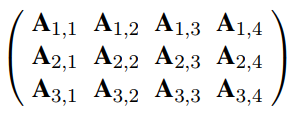
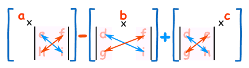

# Vectors and Matrices

## Vectors
Vector = a member of a vector space
* An ordered sequence of values

Denoted by bold-face characters or arrows/bars over the names:

**2-dimensional space** example:
* **x** = <3,4>
* **y** = <0,2>

**Vector Addition** = elementwise sum:
* **x** + **y** = <3+0,4+2> = <3,6>
* In n-dimensional Euclidean space, equivalent of placing the tail of one vector at the head of another

**Scalar Multiplication** = multiplies each element by a constant:
* 5**x** = <5*3,5\*4> = <15,20>

**Magnitude/Length**:
* Square root of the sum of the squares of the elements
* |**x**| = sqrt(3<sup>2</sup>+4<sup>2</sup>)=5

**Dot(scalar) Product**:
* Sum of the products of the corresponding elements
* **x**&middot;**y** = &sum;<sub>i</sub>x<sub>i</sub>y<sub>i</sub>
* **x**&middot;**y**=3*0 + 4\*2 = 8
* In n-dimensional Euclidean space, equivalent to |**x**| |**y**| cos&theta; where &theta;=angle between **x** and **y**

## Matrices
Matrix = rectangular array of values arranged into rows and columns
* Matrix **A** of size 3x4:
    * 

**Sum of two matrices**:
* Adding corresponding elements
* (**A**+**B**)<sub>ij</sub>=A<sub>ij</sub>+B<sub>ij</sub>
* **Undefined** if matrices have different sizes

**Multiplication by scalar**:
* Each element multiplied by scalar
* (c**A**)<sub>ij</sub>=c**A**<sub>ij</sub>

**Matrix Multiplication**
* Product of two matrices
* Product **AB** is **only defined if**:
    * **A** is of size a*b and **B** is of size b\*c
    * Second matrix has same number of rows as the first has columns
    * Gives matrix of size a*c
* (**AB**)<sub>ik</sub>=&sum;<sub>j</sub>**A**<sub>ij</sub>**B**<sub>jk</sub>
* **Not commutative**:
    * **AB** != **BA**
* Is **associative**:
    * (**AB**)**C**=**A**(**BC**)

**Identity Matrix**:
* Square matrix in which all elements of the principal diagonal are **1** and all other elements are **0**
* Size = *n*\**n*
* Elements **I**<sub>ij</sub> = 1 when i=j or 0 otherwise
* Has property **AI**=**A** for all **A**
    * Multiplying a given matrix by **I** leaves the given matrix unchanged

**Transpose**:
* Formed by swapping rows and columns of a matrix
* **A**<sup>T</sup><sub>ij</sub>=**A**<sub>ji</sub>

**Determinant**:
* Calculated from  a square matrix
* For 2*2 matrix:
    * **A** = 
    ```
    [[a, b],
     [c, d]]
    ```
    * |**A**| = ad-bc
* For 3*3 matrix:
    * **A** = 
    ```
    [[a,b,c],
    [d,e,f],
    [g,h,i]]
    ```
    * |**A**|=a(ei-fh)-b(di-fg+c(dh-eg))
    * Multiply *a* by the determinant of the 2x2 matrix that is **not** in *a*'s row or column. Repeat for *b* and *c*
    * Sum up with alternating + and - (i.e *b* has -)
    * 
* For larger matrices:
    * Repeat process of 3x3 across the whole top row
    * **Remember** alternating +,-,+,- pattern

**Inverse (reciprocal) of Square Matrix**:
* The Inverse of **A**, **A**<sup>-1</sup> only when:
    * **A**&middot;**A**<sup>-1</sup> =**A**<sup>-1</sup>&middot;**A** = **I**
* Only defined **iff the determinant !=0**

**Singular Matrix**:
* Matrix that has no inverse

**Elementary Matrix**:
* Matrix which differs from the identity matrix by **one single elementary row operation**

**Leading Coefficient**
* Of a row is the first nonzero entry in that row:
```
[[1,2,0,6], -> 1
 [0,2,9,4], -> 2
 [0,0,0,4], -> 4
 [0,0,0,0]] -> no leading coefficient
```
**Row Echelon Form**
* All nonzero rows are above any rows of all zeroes
* Leading coefficient of a nonzero row is always strictly to the right of the leading coefficient of the row above it
* Implies all elements in a column below a leading coefficient = 0
```
[[1, a0, a1, a2, a3],
 0, 0, 2, a4, a5],
 0, 0, 0, 1, a6]]
```
**Reduced Row Echelon Form**
* Matrix is in row echelon form **and** every leading coefficient = 1 and is the only nonzero entry in its column
```
[[1, 0, a1, 0, b1],
 0, 1, a2, 0, b2],
 0, 0, 0, 1, b3]]
```
### Elementary Matrix Operations
**Row Switching**:
* R<sub>1</sub>&harr;R<sub>2</sub> = switch row 1 and row 2
```
[[a,b,c],           [[d,e,f],
 [d,e,f], R1 <-> R2  [a,b,c],
 [g,h,i]]            ['g,h,i]]
```
**Row Multiplication**
* 3R<sub>2</sub>&rarr;R<sub>2</sub> = multiply each element in row two by 3
* Multiple each element in row by a **non-zero constant**
```
[[a,b,c],          [[a,b,v],
 [d,e,f], 3R2 -> R2 [3d,3e,3f],
 [g,h,i]]           [g,h,i]]
```

**Row Addition**
* R<sub>1</sub>+R<sub>2</sub>&rarr;R<sub>2</sub> = replace row 2 with the sum of row 1 and row 2
```
[[a,b,c],             [[a,b,c],
 [d,e,f], R1+R2 -> R2  [a+d,b+e,c+f],
 [g,h,i]]              ['g,h,i]]
```

### Gaussian Elimination

### Solving linear equations with Matrices
O(n<sup>3</sup>) time

To find a solution in *x*, *y* and *z* for the equations:
```
2x + y -z = 8
-3x - y + 2z = -11
-2x + y + 2z = -3
```
Represent as matrix equation **Ax** = **b**:
(x_=**x** for clarity in code blocks)
```
A = [[2,1,-1],
     [-3,-1,2],
     [-2,1,2]]
x_ = [[x],[y],[z]]
b = [[8],[-11],[-3]]
```
Multiply both sides by **A**<sup>-1</sup>:
* **A**<sup>-1</sup>**Ax** = **A**<sup>-1</sup>**b**
* **x** = **A**<sup>-1</sup>**b**

Invert **A** and multiply by **b**:
```
x_ = [[x],    [[2],
     [y],  =  [3],
     [z]]     [-1]] 
```