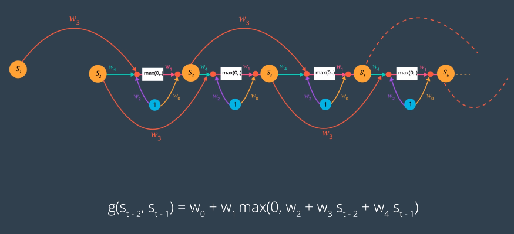

# Recursivity in FNN's

Goal = Resolve a recursive formula that is a good approximation of the truth
* True sequence doesn't necessarily need to be recursive
1. Choose architecture (order, functionality)
2. Break recursion into levels
3. Window sequence -> input/output pairs
4. Minimize loss
5. Regressor is the generative model

Given a sequence, find a function that generates it using a feed forward network.

Use linear network to get an approximation of the **true** recursive function

## Problems
Using Least Squares loss assumes Input/Output pairs are **independent and identically distributed**
* A change in values of on pair doesnt necessitate change in other pairs
* **WRONG** for recursive sequences
    * Tying to model dependency -> recursiveness
    * Tuning parameters -> make things independent
    * **Undercutting** goal!
* **THIS IS NOT A GOOD RNN MODEL** see [RNN-derivation.md](./RNN-derivation.md)
## Windowing
Process the sequence data for training the model

'Slide' window over the sequence, taking input and output pairs for training.


For odd number sequence:


## Example 1
Given sequence 1,3,5,7,9,11,13,15:
* True recursive function = f(s) = 2 + s

Take a parametrized function, learn weights by fitting using a **Feed forward** network
* g(s) = w<sub>0</sub> + w<sub>1</sub>s
* s<sub>1</sub> = 1
* s<sub>2</sub> = w<sub>0</sub> + w<sub>1</sub>s<sub>2</sub>
* s<sub>3</sub> = w<sub>0</sub> + w<sub>1</sub>s<sub>3</sub>
* ...
* s<sub>8</sub> = w<sub>0</sub> + w<sub>1</sub>s<sub>7</sub>

Learn weights by minimizing a **least squares cost** function:
* &sum;<sup>8</sup><sub>t=2</sub> (S<sub>t</sub>-(W<sub>0-</sub>+w<sub>1</sub>s<sub>t-1</sub>))<sup>2</sup>
* **Regression**
* g(s) = w<sub>0</sub> + w<sub>1</sub> is a simple **feed forward network**

### Keras Implementation
```Python
import keras
from keras.models import Sequential
from keras.layers import Dense
# prevent OSError raw write() returned invalid length on Windows
import win_unicode_console
win_unicode_console.enable()

model = Sequential()
model.add(Dense(1, input_dim=1, activation='linear'))
model.compile(loss='mean_squared_error', optimizer='adam')

x = [[1], [3], [5], [7], [9], [11], [13]]
y = [[3], [5], [7], [9], [11], [13], [15]]

model.fit(x, y, epochs=3000, batch_size=3)

print(model.get_weights())
```
Model weights output:
```Python
[array([[ 0.97954911]], dtype=float32), array([ 2.18252492], dtype=float32)]
```
Weights are very close to the true recursive function:
* f(s) = 2 + s
* g(s) = 0.97954911 + 2.18252492s

## Example 2
* Recursive sequence using the RELU function
* s<sub>1</sub> = 1, s<sub>2</sub> = 0.5
* s<sub>3</sub> = 0.4*max(0,1 + s<sub>1</sub>-0.1s<sub>2</sub>)
* s<sub>4</sub> = 0.4*max(0,1 + s<sub>2</sub>-0.1s<sub>3</sub>)
* ...
* s<sub>50</sub> = 0.4*max(0,1 + s<sub>48</sub>-0.1s<sub>49</sub>)


Given the sequence, estimate its generating function:
* s<sub>1</sub> = 1, s<sub>2</sub> = 0.5
* s<sub>3</sub> = w<sub>0</sub>*w<sub>1</sub>max(0,w<sub>2</sub> + w<sub>3</sub>s<sub>1</sub>-w<sub>4</sub>s<sub>2</sub>)
* s<sub>4</sub> = w<sub>0</sub>*w<sub>1</sub>max(0,w<sub>2</sub> + w<sub>3</sub>s<sub>2</sub>-w<sub>4</sub>s<sub>3</sub>)
* ...
* s<sub>50</sub> = w<sub>0</sub>*w<sub>1</sub>max(0,w<sub>2</sub> + w<sub>3</sub>s<sub>48</sub>-w<sub>4</sub>s<sub>49</sub>)

Sum the squared difference between each side at each level of the recursion to give least squares loss function:
* &sum;<sup>50</sup><sub>t=3</sub> (S<sub>t</sub>-w<sub>0-</sub>+w<sub>1</sub>max(0,w<sub>2</sub> + w<sub>3</sub>s<sub>t-2</sub>-w<sub>4</sub>s<sub>t-1</sub>))<sup>2</sup>

* **Regression**
* A two-layer network -> one RELU, one linear



**Windowing** to get inputs and outputs
* Order-2 recursion -> window size must be length 2
    * Takes two items of sequence as input and one as output at each step

    

### Keras
```Python
model = Sequential()
model.add(Dense(1, input_dim=2, activation='relu'))
model.add(Dense(1, activation='linear'))
model.compile(loss='mean_squared_error', optimizer='adam')
# x, y generate from given sequence
model.fit(x, y, epochs=1000, batch_size=20)
```