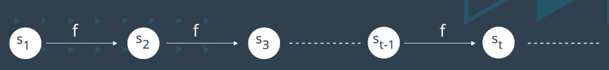
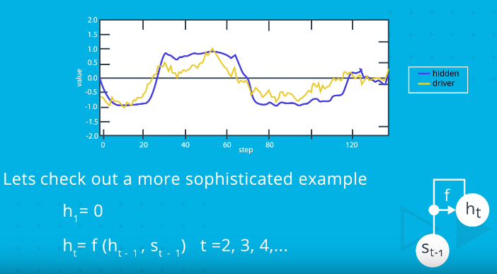

# Recursive Sequences
* Seed = Original value(s) of a recursive sequence which must be defined
* Order = number of prior elements future values are dependent on
* Odd numbers:
    * S1 = 1 -> Seed
    * Sn = 2 + Sn-1
    * Order = 1
* Fibonacci Sequence:
    * S1 = 1, S2 = 1 -> Seed values
    * Sn = Sn-2 + Sn-1
    * Order = 2

* Unfolded view (Odd numbers):
    * 
* Folded view (Odd numbers):
    * s1 = 1
    * f(s) = 2 + s
    * st = f(st-1) t = 2,3,4...
* Folded view (fibonacci):
    * s1 = 1, s2 = 1
    * f(st-2,st-1) = sn-2 + sn-1
    * st = f(st-2,st-1) t= 3,4,5...

## Driving Recursive Sequences
* **Driver Sequence** = Receive input values as data 
* **Hidden Sequence** = Generate values recursively using driver sequence

