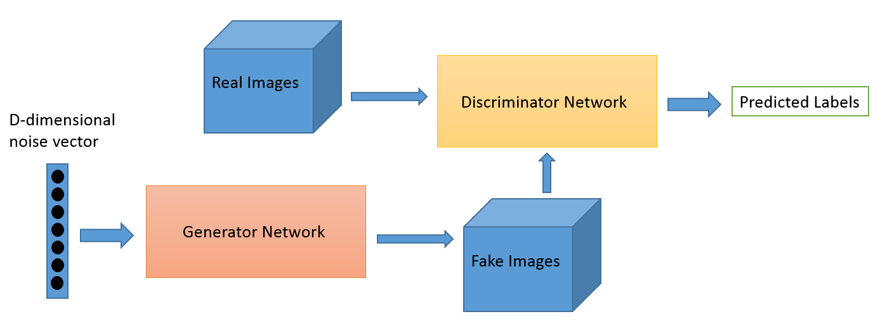

# Generative Adversarial Networks (GANs)

Deep neural net architecture comprised of **two nets** pitted against each other.

* Generator network
* Discriminator network

Good Resources:

* [Ian Goodfellow paper](https://arxiv.org/pdf/1406.2661.pdf)
* https://deeplearning4j.org/generative-adversarial-network

**Discriminative algorithm**: Classifies input data i.e. given the features of a data instance, predict a label or category to which it belongs.

* Learn the **boundary** between classes

**Generative alogrithm**: Given a label, predict the features that would produce the label.

* Model the **distribution** of individual classes

For labels `y` and features `x`:

* Discriminative algo gives `p(y|x)`
* Generative algo gives `p(x|y)`

## GANs

* Generator network generates new data instances
  * Aim to generate images that the discriminator will assign probability ~1 of being real
* Discriminator network evaluates them for 'authenticity'

  * Decides whether it belongs the the real training set or not
  * Aim to give probability ~1 to real images, and probability ~0 to fake images

* Over time, generator is forced to produce more realistic outputs to 'fool' the discriminator

* Generator take random noise values _z_ and maps them to outputs _x_
* Wherever generator maps more values of _z_, the probability distribution over _x_ represented by the model becomes denser
* Discriminator outputs high values wherever density of real data is greater than the density of generated data
* Generator changes the produced samples to move _uphill_ to move along the function learned by the discriminator
  * Generator moves its samples into areas where the model distribution is not yet dense enough
* Eventually, generator distribution matches the real distribution and discriminator has to output a probability of 0.5 everywhere

  * Equal densities
  * This equilibria is unlikely to be found perfectly in practice

* Generator takes in random numbers and returns an image
* Generated image is fed into discriminator alognside a stream of images taken from the _actual_ training dataset
* Discriminator takes in both real and fake/generated images and returns probabilities of the images being authentic

**Double feedback loop**:

* Discriminator in a feedback loop with the _ground truth_ of images
* Generator is in a feedback loop with the discriminator

* Discriminator is a standard convolutional network
  * Binomial classifier of input images (real or fake)
* Generator is an 'inverse' convolutional network

  * Takes vector of random noise and **upsamples** it to an image
    * Generate new data
  * Normal convolutional networks take in animage and **downsample** it to produce a probability
    * 'Throw away' data i.e max pooling

* Networks try to optimize a **different and opposing** objective/loss function in a **zero sum game**
* **Actor/critic model**: As discriminator changes behaviour, so does generator etc
