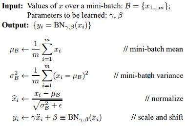

# Batch Normalization

Method of adaptive reparametrization in which normalization is made part of the network architecture by normalizing layer inputs for each training mini-batch.

## Advantages

1.  Reduces Internal Covariate Shift
2.  Reduces dependence of gradients on the the model parameters and their initial values
    * Weights are easier to initialize
3.  Regulaizes the model and reduces the need for dropout and other regularization techiniques
4.  Allows use of saturating non-linearites
    * More viable activation functions
5.  Speeds up training as networks converge faster
6.  Allows higher learning rates

## Motivation: Problems Training Deep NN's

### Internal Covariate Shift

During training, distribution of each layer's inputs changes as the parameters of the previous layer change

* Inputs to each layer are affected by the parameters of _all precedding layers_
  * Small changes to network parameters **amplify** as the network deepens

Networks generally converge faster if the inputs are **whitened** -> zero mean, unit variances. Internal Covariate Shift leads to the opposite of this.

### Vanishing Gradient

* Saturating non-linearities lead to vanishing gradients
  * Saturating activation function squeezes the input
  * **f** is non-saturating iff (|limz→−∞f(z)|=+∞)∨|limz→+∞f(z)|=+∞)
  * **f** is saturating iff **f** is not non-saturating.
* For example, tanh and sigmoid cannot be used
* Limits available activation functions

## Batch Normalization

Normalize each scalar feature independently, giving is the mean of zero and variance of 1:

* For layer with _d_-dimensions **x**=(x1...x(d)), the _k_th dimension is normalized by:

  

Normalized values must be **scaled and shifted** to avoid limiting the layers representational capacity

* i.e. normalizing inputs to a sigmoid function makes the output bound to the linear region only.

Add **learned parameters** for each activation _x_(k):

* &gamma; and &beta; are parameters to be learned.

### Batch Normalizing Transform

* Batch Normalizing Transform applied to activation _x_ over a mini-batch
* &epsilon; is a constant added to the mini-batch variance for numerical stability (avoid dividing by zero etc)

### Batch Normalizing a Network

Specify a subset of activations and insert Batch Normalizing transform for each of them.

#### Inference

During inference/testing, the output must depend only on the input, deterministically

* Can't use normalization of activations for mini batches

Must use **population statistics**, not minibatch statistics.

After training, normalization is given by:

* Using population statistics

### Training a Batch-Normalized Network

### Batch-Normalized Convolutional Networks

* Batch-Normalizing transform is added before the _nonlinearity_ in a layer.
* Activations in a min-batch are _jointly normalized_ over all locations and parameters &gamma; and &beta; are learnt _per feature map_ insetad of per activation
  * Normalization should maintain the **convolution property**
    * Different elements of the same feature map, at different locations, are normalized in the same way
* Bias terms can be ignored since it's effect will be cancelled by the mean subtraction during Batch-Normalizing transform
  * &betal; subsumes the role of the bias

Given an affine transformation followed by element-wise non-linearity commonly found in CNN layers:

* z = g(W&middot;u+b)
  * W and b are learned parameters of the model (Weights and bias respectively)
  * g(.) is nonlinearity i.e. sigmoid
* Becomes:
  * z = g(BN(W&middot;u))
    * BN(.) is the Batch-Normalizing transform
      * Applied independently to each dimension of x=W&middot;
      * Separate pair of learned params &gamma;(k), &beta;(k) per dimension

Resources:

* [Batch Normalization Paper](https://arxiv.org/pdf/1502.03167.pdf)
* [Deep Learning Book 8.7.1](http://www.deeplearningbook.org/contents/optimization.html)
